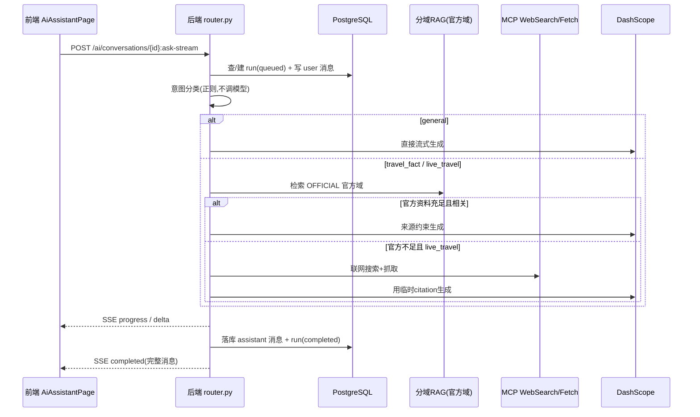

# AI 智能助手实现流程

> 本文档讲解项目中 AI 对话助手（AI 问答）的完整实现流程，从用户在前端发消息，到后端检索、联网、生成、流式返回、落库的每一步。
> 它与"行程生成 LangGraph 工作流"是两条独立的 AI 链路，本文会同时讲清两者的边界。
> 所有代码位置均为仓库相对路径。

---

## 一、定位与边界

AI 智能助手是消费者端 `/assistant` 页面的对话式问答能力：用户问"故宫几点开门""成都三天怎么玩"，助手流式返回带来源引用的回答。

它和行程生成工作流共享同一套 RAG 基础设施，但**不是第二个工作流**。核心边界有三条：

1. **只回答，不生成可执行行程**：助手输出是纯文本建议，不调用行程生成的 LangGraph，不写任何正式行程。
2. **只查官方域，不加载对话历史**：助手只检索 OFFICIAL 官方知识域，每次只把当前问题交给模型，不做多轮上下文拼接。
3. **联网内容只做临时引用**：联网搜索结果只存在本次消息的 citations 里，不写公共 RAG、不写用户长期记忆。

> 一句话定位：**行程生成是"高风险、要落库、需用户确认"的受控工作流；AI 助手是"低风险、纯建议、有来源才答"的轻量问答。**

---

## 二、整体流程总览

一条消息从发出到收到回复，走完整链路如下：



设计上遵循四条原则：

- **来源约束**：旅行事实类回答只依据传入来源生成，无来源只给澄清，不编造。
- **临时联网**：联网只在"官方资料不足且问题涉及实时信息"时触发，结果一次性使用。
- **幂等可靠**：`client_message_id` 保证重试不重复扣权益、不重复调模型、不重复插消息。
- **断线可恢复**：run 持久化到 PostgreSQL，前端断线后可重放事件流。

---

## 三、前端实现

### 3.1 页面与入口

- 路由：`frontend-c/src/router/index.ts` 的 `/assistant`，需消费者登录。
- 页面：`frontend-c/src/features/ai/pages/AiAssistantPage.vue`。
- API 封装：`frontend-c/src/features/ai/assistantApi.ts`。

### 3.2 发消息与乐观渲染

用户发送消息时（`ask()`，第 58-88 行），前端不等待后端，先做**乐观渲染**：

1. 校验当前会话、文本非空、未在请求中；
2. 置 `asking=true`，顶部状态胶囊显示"正在检索已审核旅行资料"；
3. 本地 push 两条临时消息：`optimistic`（user 角色）和 `provisional`（assistant 角色，空文本），id 用 `crypto.randomUUID()`；
4. 调用 `streamAiAssistant(activeId, { text, client_message_id: crypto.randomUUID() }, onEvent)`——`client_message_id` 每次提问随机生成，作为幂等键。

`onEvent` 回调按事件类型更新界面：

| 事件 | 前端行为 |
| --- | --- |
| `progress` | 更新状态胶囊文案（显示当前阶段） |
| `delta` | 追加到 `provisional` 气泡，实现逐字流式 |
| `completed` | 用服务端持久化的完整消息替换 `provisional` |
| `failed` | 移除 `provisional`，显示错误 |

### 3.3 SSE 流式消费

`consumeSse`（第 37-89 行）用原生 `fetch`（非 axios）请求 `POST /ai/conversations/{id}:ask-stream`，带 `Accept: text/event-stream`、`Authorization: Bearer`、`X-Request-ID`。401 时自动刷新 token 重试一次。

解析方式：`TextDecoder` 解码 + 按 `\n\n` 切帧，每帧取 `event:` 与 `data:` 行，`JSON.parse(data)` 后按 `run_id` 校验，再按事件类型分发。

### 3.4 断线恢复与重放

若流式请求抛错但已拿到 `runId`，前端调用 `replayAiAssistantRun(runId, onEvent)` 重放；`finally` 中若 `runId` 存在则重新拉取消息列表兜底，并清理乐观消息。这样网络抖动不会让用户看到"半条消息"。

### 3.5 引用来源展示

每条 assistant 消息若 `content.citations` 非空，渲染 `<details>` 折叠面板，标题"查看 N 条来源"。每条 citation 显示 `source_type`（如 `reviewed_knowledge` / `live_web`）、`source_host`（联网来源域名）和内容摘要——**回答的每个事实都能点开看来源**。

---

## 四、后端接口与 SSE 协议

### 4.1 接口清单

后端集中在 `backend/app/modules/ai_memory/router.py`（`APIRouter(prefix="/ai")`），全部要求消费者登录态：

| 接口 | 说明 |
| --- | --- |
| `GET /ai/conversations` | 列出当前用户会话 |
| `POST /ai/conversations` | 创建会话 |
| `DELETE /ai/conversations/{id}` | 删除会话（级联删消息/run） |
| `GET /ai/conversations/{id}/messages` | 列出消息 |
| `POST /ai/conversations/{id}:ask` | 非流式问答（同步返回 user+assistant 消息） |
| `POST /ai/conversations/{id}:ask-stream` | 流式问答（SSE） |
| `GET /ai/assistant-runs/{run_id}/events` | run 重放（断线恢复） |

### 4.2 SSE 帧格式与事件类型

流式接口返回 `StreamingResponse`，`media_type="text/event-stream"`，带 `Cache-Control: no-cache` 和 `X-Accel-Buffering: no`（防止 Nginx 缓冲破坏流式）。

帧格式（`_sse`，第 99-100 行）：

```text
id: {event_id}
event: {event}
data: {json}

```

四种事件类型：

| 事件 | 字段 | 含义 |
| --- | --- | --- |
| `progress` | `run_id, phase, message` | 阶段更新；phase 取值 `processing` / `general_answer` / `official_retrieval` / `live_web_search` / `live_web_fetch` |
| `delta` | `run_id, text` | 模型增量文本，逐段推送 |
| `completed` | `run_id, message` | 完整消息（含 citations、kind） |
| `failed` | `run_id, code, message` | 失败，带错误码 |

### 4.3 幂等键 client_message_id

请求体 `AssistantAskRequest` 要求 `text`（1-2000 字符）和 `client_message_id`（1-128 字符）都必填。

流式路径先按 `client_message_id` 查已存在消息：若已存在则**不重复扣权益**，直接复用 run 走重放分支；只有新消息才扣减一次 `assistant_message` 权益。权益扣减失败会 `release` 回滚。

---

## 五、核心回答逻辑

### 5.1 意图分类（不调模型）

后端用正则做意图分类（`_assistant_intent`，第 126-137 行），**不调用模型**，零成本且稳定：

| 意图 | 触发条件 | 处理 |
| --- | --- | --- |
| `general` | 问候语，或不含旅行关键词 | 直接流式闲聊，不查 RAG、不联网 |
| `travel_fact` | 含旅行关键词 | 查官方 RAG，不足则澄清 |
| `live_travel` | 同时含实时词（今天/现在/天气/营业/票价/库存/路况…）与旅行词 | 查官方 RAG，不足则联网兜底 |

### 5.2 官方知识检索与相关性判定

对 `travel_fact` / `live_travel`，先发 `progress(official_retrieval)`，然后通过 `open_ai_runtime` 打开运行时，用 `RagCatalog` **只查 OFFICIAL 官方域**（不传城市）。

检索结果分三种：

- `AVAILABLE`：有引用，进入生成；
- `NO_RESULTS` / `CLARIFICATION_REQUIRED`：官方没查到，若为 `live_travel` 则触发联网；
- 其他不可用：返回澄清文本。

关键细节是**相关性判定**（`_official_contexts_address_question`，第 117-123 行）：从问题开头提取 2 个中文字符作为目的地，检查 citations 内容是否包含该目的地。这是为了**拒绝全局 RAG 的误命中**——防止检索到不相关的官方片段却当作回答依据。

### 5.3 联网兜底触发条件

联网不是随便触发的，只有同时满足：意图是 `live_travel`，且官方 RAG 无结果 / 需澄清 / 片段不相关。触发后发 `progress(live_web_search)` 和 `progress(live_web_fetch)`，调用 MCP 搜索并抓取正文，`source_mode="live_web"`。

### 5.4 来源约束模型生成

`SourceBackedAssistant`（`backend/app/modules/ai_memory/assistant.py`）的 system prompt 明确：**只依据传入来源回答，不得编造事实、价格、营业时间、路线、POI 或来源声明**；来源未回答时明确说明不确定性。

生成时逐段 yield `delta`，前端实时拼接。模型 payload 只有 system + 当前 user 消息，**不加载完整对话历史**。

### 5.5 退化策略（无来源 / 模型失败）

| 场景 | 处理 |
| --- | --- |
| `live_travel` 联网后仍无 citations | 返回澄清文本："暂未找到可用于回答的已审核资料或网络搜索结果，请补充目的地或具体需求后再试" |
| RAG 不可用且不联网 | 返回 RAG 的 message 澄清文本 |
| 有 citations 但模型流失败 | 用 `_citation_fallback_answer` 直接拼接来源摘要作为退化回复，仍带来源 |
| `general` 分支 | 允许无来源自然交流，但 prompt 禁止声称实时旅行事实 |

核心原则：**旅行事实类回答强制要求来源；无来源只给澄清，不调用模型扩写。**

---

## 六、数据模型与状态机

AI 助手的数据存在 **PostgreSQL**（非 MySQL），通过独立的 `ai_postgres_dsn` 连接。三张核心表：

### 6.1 三张表

**`ai_conversations`**：会话表。`id`、`user_id`、`title`、`created_at`、`updated_at`，索引 `(user_id, updated_at DESC)`。

**`ai_messages`**：消息表。`id`、`conversation_id`（外键，级联删除）、`user_id`、`role`（user/assistant/system/tool）、`content`（JSONB）、`client_message_id`、`created_at`。唯一索引 `(conversation_id, user_id, client_message_id)`。

`content` JSONB 结构：user 消息 `{"text": ...}`；assistant 消息 `{"text": ..., "citations": [...], "kind": "source_backed"|"live_web"|"general"|"clarification"}`。

**`ai_assistant_runs`**：运行表。`id`、`conversation_id`、`user_id`、`client_message_id`、`user_message_id`、`assistant_message_id`、`status`（queued/running/completed/failed）、`source_mode`（official/live_web）、`error_code`、`error_message`、时间戳。唯一约束 `(conversation_id, user_id, client_message_id)`。

### 6.2 run 状态机

```
queued ──start──▶ running ──complete──▶ completed
   │                 │
   └────fail─────────┴────fail──▶ failed
```

- `create_assistant_run`：事务内先查 `(conversation_id, user_id, client_message_id)` 是否已有 run，有则直接返回（幂等）；否则先写 user 消息，再 INSERT run 为 `queued`。
- `start_assistant_run`：`UPDATE ... SET status='running' WHERE id=$1 AND user_id=$2 AND status='queued'`——**只有 queued 能转 running**，返回 None 表示已被并发请求抢占。
- `complete_assistant_run`：`FOR UPDATE` 锁行；若已 completed 直接返回既有消息；否则写 assistant 消息并置 `completed`、`source_mode`、`completed_at`。
- `fail_assistant_run`：仅 `queued`/`running` 可转 `failed`，记录错误码（截 64 字符）和错误信息（截 500 字符）。

### 6.3 消息幂等实现

`_append_message` 用 `INSERT ... ON CONFLICT (conversation_id, user_id, client_message_id) DO UPDATE SET client_message_id = ai_messages.client_message_id`——冲突时保持原行（no-op），避免重复插入。assistant 消息的幂等键是 `f"{client_message_id}:assistant"`。

这套设计保证：**网络重试不会重复扣权益、重复调模型、重复插消息。**

---

## 七、MCP 联网集成

### 7.1 WebSearch / Fetch 实现

`backend/app/integrations/mcp/websearch.py` 用 Streamable HTTP MCP 协议（JSON-RPC）：`initialize`（取 `mcp-session-id`）→ `notifications/initialized` → `tools/call`。工具名、端点、API key 全部来自后端配置。

**关键设计：不由模型自由决定调用参数。** 这是受控联网，不是 agent loop——后端确定 query 内容、数量上限（搜索 12 → 重排 8）、抓取上限（前 5 个 URL）、正文长度上限，模型不参与工具选择或参数构造。Fetch 工具只接受 `https` 且带 hostname 的 URL。

### 7.2 候选过滤与排序

`rank_web_search_candidates` 按规则打分：query 词覆盖度（每命中 +4.0）、来源质量（`gov.cn`/`amap.com`/`map.baidu.com` +3.0）、景点关键词（+2.0）、发布时间（+0.5），按 `(host, title)` 去重取前 8。只保留 HTTPS、标题 ≤300、摘要 ≤4000 字符，剔除含原始正文字段的条目。

若首轮结果无具体景点内容，用 `"{query} 具体景点名称 景区推荐"` 再搜一次。

### 7.3 临时 citation 切块与标记

- 并发抓取前 5 个 URL（`asyncio.gather`），抓取失败直接丢弃；
- `chunk_web_content` 规范化空白后按 **2000 字符/段、最多 8 段**切块，`chunk_id = f"{原chunk_id}:{index}"`；
- 临时标记：`document_id`/`chunk_id` 用 `live-web:{index}` 前缀，`source_type="live_web"`，`source_mode="live_web"` 写入 run。

**不写入公共知识库**：联网正文只存进本次 assistant message 的 `citations`（JSONB），不触发知识审核、不写 Milvus/ES、不写用户长期记忆。公共知识入库仍必须经过管理员人工审核。

---

## 八、会话管理

- **创建**：`POST /ai/conversations`，UUID 主键，绑定 `user_id`，前端默认标题"旅行助手"。
- **关联用户**：所有查询都带 `user_id` 过滤，跨用户访问不可见。
- **历史消息加载**：`GET /ai/conversations/{id}/messages` 按 `ORDER BY created_at, id` 全量返回，前端全量替换消息列表。
- **上下文组织**：**不加载完整对话历史进模型**。每次只把当前 `text` 传给模型，无多轮拼接、无截断逻辑——这是刻意的简化，保证每次回答都基于当前问题 + 当前检索来源。
- **记忆**：`ai_memories` 表由用户显式 CRUD 或设置同步写入；**对话助手本身不自动读记忆**，记忆主要供行程生成工作流加载。

---

## 九、与行程生成工作流的对比

### 共用基础设施

| 设施 | AI 助手 | 行程生成 LangGraph |
| --- | --- | --- |
| 分域 RAG | 共用，只查 OFFICIAL 域 | 共用，查 OFFICIAL + COMMUNITY，按城市过滤 |
| 记忆 | 不读 | 经 `PrivateMemoryProfileLoader` 加载 + 版本闸门 |
| MCP WebSearch/Fetch | 仅 `live_travel` 且官方不足时 | 仅候选 POI 不足时，且要转高德 POI 验证 |
| PostgreSQL | 会话/消息/run | checkpoint/preview/citations/audit |
| DashScope LLM | `SourceBackedAssistant` | `DashScopeStructuredDraftGenerator` |
| 权益扣减 | `assistant_message` | `itinerary_generation` |

### 风险等级与处理差异

| 维度 | AI 助手 | 行程生成 |
| --- | --- | --- |
| 输出 | 纯文本建议 | 可确认写入正式行程的 preview |
| 是否写业务表 | 否 | 用户确认后版本化写入 MySQL |
| 是否需要 HITL | 否 | 是（用户确认 + 管理员审核知识 + 版本化写入） |
| 无来源处理 | 澄清，不编造 | 候选不足则失败，不让模型编造 |
| 联网结果 | 一次性临时引用 | 必须解析为高德验证 POI 才能用 |

> 一句话总结边界：**"普通聊天"、"来源约束旅行问答"与"可执行行程变更"保持不同风险等级，是这套拆分设计的核心。**

---

## 十、关键文件速查

| 文件 | 作用 |
| --- | --- |
| `frontend-c/src/features/ai/pages/AiAssistantPage.vue` | 前端页面、乐观渲染、断线恢复、引用展示 |
| `frontend-c/src/features/ai/assistantApi.ts` | 前端 API 契约与 SSE 消费 |
| `backend/app/modules/ai_memory/router.py` | 后端路由、SSE、意图分类、联网触发 |
| `backend/app/modules/ai_memory/assistant.py` | 来源约束模型（system prompt、流式生成、退化回复） |
| `backend/app/modules/ai_memory/postgres.py` | 三张表、run 状态机、消息幂等 |
| `backend/app/modules/ai_memory/schemas.py` | Pydantic 请求/响应契约 |
| `backend/app/integrations/mcp/websearch.py` | MCP WebSearch/Fetch、候选过滤、切块 |
| `backend/app/modules/ai_rag/catalog.py` | 分域 RAG 目录（OFFICIAL/COMMUNITY/USER_MEMORY） |
| `backend/app/modules/ai_entitlements/service.py` | AI 权益扣减（`assistant_message`） |
| `backend/app/modules/ai_workflows/runtime.py` | `open_ai_runtime` 运行时装配（与行程生成共用） |

参考文档：`docs/当前项目工作流程与AI实现详解.md` 第 8 章"AI 对话助手：共享 RAG，但不是第二个工作流"、`docs/API设计.md` 第 118-124 行"Official Travel Assistant"契约。
