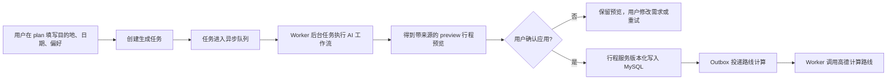
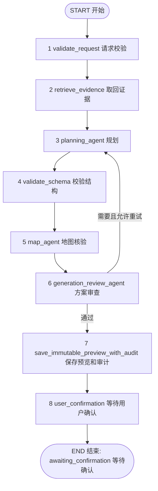
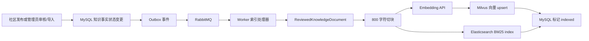
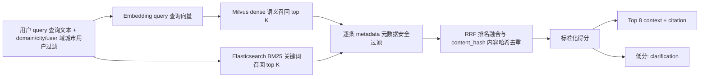
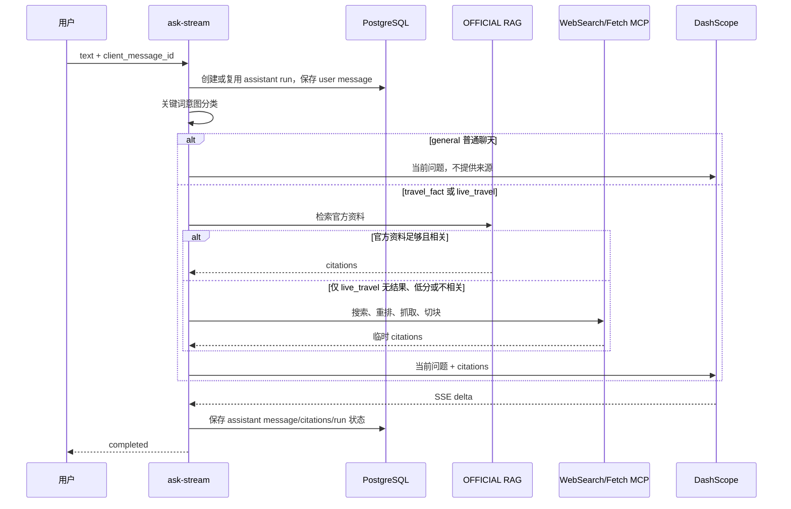

# 当前项目工作流程与 AI 实现详解

> 基于当前代码整理，重点代码目录为 `backend/app/modules/ai_workflows`、`ai_rag`、`ai_memory`、`ai_agents` 和 `backend/app/workers`。
>
> 本文刻意先讲用户能经历到的业务流程，再讲系统如何实现。文中的“当前实现”以代码为准；对于尚未实现的 GraphRAG、自治多智能体等能力，会明确标注，避免把架构设想当成已上线能力。

---

## 阅读说明：英文后的中文备注

代码中的类名、接口名、数据库字段和状态值必须保留英文，才能与源码一一对应；本文第一次出现或高频出现时，均按“`英文标识（中文含义）`”阅读。下面这张表可以在阅读后文时随时对照。

| 英文术语/状态 | 中文备注 |
| --- | --- |
| AI Workflow | AI 工作流，即多个固定步骤组成的自动化处理流程 |
| preview | 行程预览。它是待确认建议，不是已经生效的正式行程 |
| Worker | 后台任务执行程序，负责处理耗时的生成、索引、路线计算等任务 |
| Outbox | 事务发件箱。先和业务数据一起入库，再可靠投递消息，避免任务丢失 |
| RAG | 检索增强生成。先检索可信资料，再把资料交给模型回答或生成 |
| citation | 引用证据片段，记录内容来自哪一条知识资料或网页 |
| POI | Point of Interest，兴趣点/地点，例如博物馆、景区、公园 |
| MCP | Model Context Protocol，模型上下文协议；本项目用它受控调用网页搜索和网页读取工具 |
| LLM | Large Language Model，大语言模型；本项目用它生成 JSON 行程草案和流式回答 |
| checkpoint | 工作流检查点。任务中断时可据此恢复状态 |
| audit | 审计记录，保存每一步做了什么、耗时多久、是否有降级或审查问题 |
| HITL | Human in the Loop，人工介入/人工确认机制 |
| dense retrieval | 语义向量召回，按语义相近程度找资料 |
| BM25 | 关键词召回算法，按词语匹配程度找资料 |
| RRF | Reciprocal Rank Fusion，倒数排名融合，用于合并语义召回和关键词召回的结果 |
| OFFICIAL / COMMUNITY / USER_MEMORY | 官方知识域 / 社区知识域 / 用户私有记忆域 |
| JSON | 一种结构化数据格式。本项目要求模型按固定 JSON 结构返回行程 |
| `queued` / `understanding` / `awaiting_confirmation` | 排队中 / 理解处理中 / 等待用户确认 |
| `no_result` / `unavailable` | 没有可靠结果 / 外部依赖暂时不可用 |
| `verified_candidates` | 已验证地点候选池，模型只能从这里选地点 |
| `WorkflowState` | 工作流状态对象，保存一次生成任务在各步骤间传递的全部数据 |

后文中像 `state.citations`、`GenerationJobService` 这类带反引号的内容是**源代码原名**；紧跟的中文说明就是它在本项目中的作用。

---

## 1. 先从整体工作流程理解这个项目

### 1.1 这个平台解决的事情

这是一个旅行规划平台。用户不是直接让 AI 写入一份正式行程，而是先给出目的地、日期、偏好和想去的地点，系统生成一份带来源的 **行程预览（preview，待确认的建议方案）**。系统会核对地点、日期和证据；用户确认后，普通业务服务才把它落为正式行程。

因此，项目中最重要的分工不是“模型生成什么”，而是：

| 角色 | 负责内容 | 被禁止做的内容 |
| --- | --- | --- |
| 用户 | 提交需求、选择必去地点、确认或放弃预览、维护自己的记忆 | 读取其他用户资料、直接操作内部 AI 状态 |
| AI 工作流 | 检索资料、准备已验证 POI、生成 JSON 草案、生成 preview | 直接修改 MySQL 中的正式行程、订单、支付、权限、审核状态 |
| 管理员 | 审核公共知识、审核网页候选资料、管理 POI 候选 | 绕过审核把网页内容直接投进公共知识库 |
| 行程业务服务 | 版本化写入行程、并发控制、投递路线计算任务 | 生成或相信未经验证的 AI 内容 |
| Worker | 消费异步事件，执行生成、索引和路线计算 | 绕过业务契约进行直接业务写入 |

这条边界决定了系统的安全模型：**AI 只形成建议和证据链，影响用户资产的动作必须由用户显式确认，并通过原有业务服务执行。**

### 1.2 用户规划一趟旅行时发生什么



用一个具体例子理解：用户希望“成都 3 天游，喜欢博物馆和美食，必去宽窄巷子”。系统不会让模型凭空写成都行程。它先找到同城、已审核的知识和已审核 POI；若地点候选不足，会在受控范围内尝试实时网页搜索并由高德解析、验证地点；模型只能从最后的验证候选池中挑选 POI ID。输出还会经过日期、城市和证据检查。最终展示的只是预览，不是已生效行程。

### 1.3 两条面向用户的 AI 链路

| 链路 | 用户入口 | 主要结果 | 是否 LangGraph | 是否会写正式行程 |
| --- | --- | --- | --- | --- |
| 智能行程生成 | 消费者端 `/plan` | 可确认的行程 preview（预览） | 是 | 否，确认后由行程服务写入 |
| AI 对话助手 | 消费者端 `/assistant` | 来源约束的流式回答 | 否 | 否 |

两条链路会在需要旅行事实时共用“公共知识的 RAG 检索能力”，但并不是两个相同的智能体：

- 行程生成使用固定的 LangGraph 状态机，目标是产生严格 JSON、验证 POI，并保存 preview。
- 对话助手先区分普通聊天、旅行事实问题和实时旅行问题：普通聊天直接调用通用助手；旅行事实优先查官方资料；只有实时旅行问题资料不足时才通过 MCP 读取少量联网临时证据。
- 两者都不把普通聊天内容自动升级为长期记忆，也不把用户临时联网结果自动写入公共 RAG。

### 1.4 后端如何把同步请求变成可恢复的异步任务

消费者端向 `POST /api/v1/generation-jobs` 提交请求，必须携带 `Idempotency-Key`。对应入口是 `backend/app/modules/ai_workflows/router.py` 的 `create_generation_job`。

1. API 从登录身份得到 `user_id`，根据用户设置补全未显式填写的兴趣标签、出行节奏和旅行者类型。
2. `GenerationJobService.create` 校验目标行程归属、日期范围和版本号；修改已有行程时还保存完整的 `base_snapshot`。
3. 系统消耗一次 `itinerary_generation` AI 权益。对于新建规划，会先创建一个空的行程壳和初始版本，后续 preview 仍未应用到这个行程。
4. MySQL 创建 `generation_job`（生成任务），并在同一事务写入 Outbox（事务发件箱）事件 `ai.generation_requested`。事件携带任务 ID、用户 ID 和 `trace_id`（本次链路追踪 ID）。
5. Outbox 将事件可靠发布到 RabbitMQ；Worker（后台执行程序）消费事件并实际调用工作流。这样 API（后端接口）不必长时间等待大模型和地图服务。
6. Worker 先以悲观锁把任务从 `queued`（排队中）领取为 `understanding`（理解处理中），记录 `attempt_count`（尝试次数）、`last_attempt_at`（最近尝试时间）、`trace_id`。重复投递或已完成任务不会被第二个 Worker 重复执行。
7. 工作流完成后，Worker 将任务标记为 `awaiting_confirmation`（等待确认）、`no_result`（没有可靠结果）或 `unavailable`（依赖不可用）等终态。前端轮询任务，再请求 preview（预览）。

`GenerationJobService.mark_progress` 还保证进度只能单调前进，且 `trace_id` 必须匹配当前 Worker 尝试，旧 Worker 不能覆盖新一次重试的状态。

### 1.5 数据职责，不把检索结果当成业务事实

| 存储/组件 | 在流程中的职责 |
| --- | --- |
| MySQL | 用户、正式行程、生成任务、POI 候选、官方知识源、Outbox 等业务事实 |
| PostgreSQL | AI 私有数据：LangGraph checkpoint、preview、审计、会话、消息、长期记忆及记忆投影任务 |
| RabbitMQ + Outbox（事务发件箱） | 生成、知识索引、记忆投影、路线计算等可靠异步传递 |
| Milvus | 语义向量（dense，按语义相近找资料）检索投影，可从知识事实重建 |
| Elasticsearch | 关键词（BM25，按词语匹配找资料）检索投影，可从知识事实重建 |
| Redis | 缓存、锁、限流等辅助能力，不承担长期记忆或可靠队列职责 |
| DashScope | 结构化行程草案和来源约束回答的 LLM（大语言模型）提供方 |
| SiliconFlow/OpenAI-compatible Embedding API | `bge-m3` 等 embedding（文本向量）生成服务 |
| 高德 Web Service | POI ID 真实性、所属城市、经纬度，以及后续路线能力 |
| 魔塔 MCP WebSearch/Fetch | MCP（模型上下文协议）形式的网页候选发现和正文抓取受控工具接口 |

---

## 2. AI Workflow（AI 工作流）全貌：图、状态和执行边界

### 2.1 实际图节点与业务步骤的区别

当前 `LangGraphGenerationWorkflow`（基于 LangGraph 的行程生成工作流）位于 `backend/app/modules/ai_workflows/workflow.py`。从 LangGraph（有状态流程编排框架）图定义看，**实际有 8 个图节点**：



之所以经常会看到“9 个步骤”的表述，是因为第二个图节点 `retrieve_evidence`（取回证据）内部顺序执行了两项可独立审计的业务步骤：

1. `memory_retrieval_agent`（记忆检索步骤）：加载并过滤用户 profile（个人偏好档案）记忆。
2. `retrieval_agent`（知识检索步骤）：检索公共 RAG（检索增强生成知识库），并准备经过验证的 POI（地点）候选。

因此应这样理解：**8 个 LangGraph 调度节点，9 个对外可解释的业务步骤/审计节点。**这不是两个独立图节点并行，而是当前图把它们包在 `retrieve_evidence` 中顺序执行。每一步均会写入 `state.audit`。

### 2.2 运行时怎样创建图和 checkpoint

Worker（后台任务程序）打开 `open_ai_runtime(settings)`，该函数会：

1. 打开 AI PostgreSQL 连接池并初始化 AI 表结构。
2. 用 `open_langgraph_checkpointer` 创建 `AsyncPostgresSaver`（把工作流 checkpoint，检查点，保存到 PostgreSQL）。
3. 初始化 embedding、Milvus、Elasticsearch、分域 RAG catalog、DashScope 生成器和高德适配器。
4. 以 `LangGraphWorkflowFactory(checkpointer=checkpointer)` 创建工作流。
5. 调用 `workflow.run(request)` 时，用 `generation_job_id`（生成任务 ID）或 `workflow_run_id`（工作流运行 ID）作为 LangGraph 的 `thread_id`（同一条可恢复流程的线程 ID），再调用 `graph.ainvoke(...)`。

因此，工作流运行状态可以由 PostgreSQL checkpoint 持久化，Worker 中断后具备按 thread 恢复的基础。`progress_callback` 不进入 checkpoint：代码先以 `replace(request, progress_callback=None)` 形成可持久化请求，再用 `ContextVar` 在本次进程调用中传递实时进度回调。

### 2.3 WorkflowState：所有节点共享的状态载体

`WorkflowState`（工作流状态）是整个流程的单一状态对象。LangGraph 外层 `_LangGraphState` 只有一个字段 `workflow_state`，所有节点原地读写同一对象，因此 audit（审计轨迹）不会在节点间丢失。

| 属性 | 来源/初始值 | 由谁写入 | 后续用途 |
| --- | --- | --- | --- |
| `request` | API/Worker 构造的 `GenerationRequest` | 初始化时固定 | 城市、日期、可选具体金额上限 `budget_amount`、prompt、目标行程快照、偏好、必去 POI |
| `current_node` | 初始为 `validate_request` | `complete()` 或审查节点 | 展示当前进展与审计定位 |
| `profile_memory` | 初始 `None` | 记忆加载步骤 | 注入模型用户提示词 |
| `citations` | 初始空元组 | RAG、候选准备 | 模型事实依据、preview 引用、审查证据 |
| `verified_candidates` | 初始空元组 | 候选 POI 准备 | 唯一允许模型用于新行程的 POI 池 |
| `live_source_used` | `False` | 实时来源兜底 | 标识是否动用了联网候选 |
| `generated_draft` | `None` | 模型生成 | 保存未经业务解析的 JSON 对象 |
| `draft` | `None` | Schema 校验 | 强类型日期和活动草案 |
| `verified_draft` | `None` | 高德二次核验 | 附带真实 POI、城市、经纬度的草案 |
| `constraint_check` | `None` | 预算校验 | 记录预算是否通过及违反项 |
| `review_decision` | `None` | 审查节点 | 控制回到规划节点或保存 preview |
| `revision_count` | `0` | 审查节点 | 最多允许两次自动重新规划 |
| `preview` | `None` | preview 存储 | 保存后得到 `preview_id` |
| `confirmation_required` | `False` | 用户确认节点 | 明确工作流已停止自动写入 |
| `audit` | 空列表 | 每个节点 | 保存节点状态、版本、耗时、工具摘要、退化信息、审查代码 |

`GenerationRequest` 还包含几项影响流程的属性：`target_itinerary_id`、`base_version`、`base_snapshot` 支持对现有行程的自然语言修改；`preference_tags` 影响候选 POI 筛选；`must_visit_poi_ids` 强制模型把用户选定地点放进最终方案。

### 2.4 工作流不是自治多智能体

代码中确实有 `ControlledMemoryRetrievalService`、`ControlledRetrievalService`、`ControlledMapService` 和 `GenerationReviewService` 等“Agent”命名的受控服务，但它们不彼此自由对话、不自行规划工具调用，也没有 sub-agent 委派。

当前能力是“**固定顺序、固定依赖、固定权限的受控工作流**”：

- 没有 DeepAgents。
- 没有子智能体调度。
- 没有 Neo4j 或 GraphRAG。
- 模型调用只发生在结构化草案节点；审查、地图核验和保存均为确定性服务或业务接口。

---

## 3. AI Workflow（AI 工作流）：逐节点细粒度执行过程

### 3.1 节点 1：`validate_request`（请求校验）

**代码位置**：`backend/app/modules/ai_workflows/workflow.py` -> `LocalGenerationWorkflow._validate_request`；LangGraph 包装节点为 `LangGraphGenerationWorkflow._graph_validate_request`。

**目的**：在调用任何外部系统前拒绝明显无效的请求。

**读取状态**：`state.request` 中的 `generation_job_id`、`user_id`、`prompt`、`city_code`、`start_date`、`end_date`、`budget_amount`（若有具体金额上限）。

**操作**：

1. 要求任务 ID、用户 ID、去空白后的 prompt 非空。
2. 要求 `city_code` 非空。
3. 用 `end_date - start_date + 1` 计算天数，限制为 1 到 7 天。
4. 若存在 `budget_amount`（具体金额上限），要求不小于零。当前消费者规划页没有提交该数值。
5. 调用 `state.complete("validate_request")` 写入基础审计；生产图另外记录 `workflow@1`、耗时和 `{"validation": "completed"}`。

**工具调用情况**：无 RAG、无 MCP、无高德、无 LLM、无数据库查询。

**失败**：抛出 `RequestValidationError`，错误码 `INVALID_REQUEST`；Worker 会按工作流错误类型将任务落为可展示的失败/无结果状态。

### 3.2 节点 2：`retrieve_evidence`（取回证据）的第一部分，`memory_retrieval_agent`（记忆检索）

**代码位置**：`backend/app/modules/ai_workflows/workflow.py` -> `LangGraphGenerationWorkflow._graph_retrieve_evidence`、`LocalGenerationWorkflow._load_profile_memory`；私有记忆加载实现位于 `backend/app/modules/ai_memory/private_retrieval.py` -> `PrivateMemoryProfileLoader.load_profile_memory`；PostgreSQL 二次校验位于 `backend/app/modules/ai_memory/postgres.py` -> `AIMemoryRepository.filter_active_projected_memory_documents`。

**目的**：只加载当前用户明确管理的长期 profile（个人偏好档案）记忆，给规划提供个人化上下文。

**读取状态**：`request.user_id`、`request.city_code`、`request.prompt`。

**第一层：私有记忆加载**：

1. 调用依赖 `PrivateMemoryProfileLoader.load_profile_memory(user_id)`。
2. 它向 `RagCatalog` 发起 `DomainRetrievalRequest`：
   - `domain=KnowledgeDomain.USER_MEMORY`
   - `query="user profile preferences"`
   - `city_code=None`
   - `user_id=当前用户`
3. USER_MEMORY 域的检索过滤要求 user ID 严格匹配，避免用户之间的向量结果混用。
4. 从返回 citation 中取 `document_id + source_version`；只有每个 document ID 对应唯一版本时才继续。
5. 查询 PostgreSQL `ai_memories`，通过 `filter_active_projected_memory_documents` 二次确认：记忆属于当前用户、类型为 profile、尚未软删除、`projection_version` 与向量投影版本一致。
6. 对保留的 RAG 文本执行 `_safe_profile_document`，只接受精确形状 `{"key": "...", "value": {...}}` 的 JSON；不合法内容一律忽略。
7. 合并为 `state.profile_memory`。

**第二层：受控内存记录过滤**：

生产 LangGraph 节点将 profile 映射为 `MemoryRecord`，再调用 `ControlledMemoryRetrievalService.retrieve`。该服务以 `AgentContext(user_id, city_code)` 再做 owner 范围过滤，最后映射回 profile。这个步骤同时防止未类型化/不合法的 memory 值被传给规划模型。

**工具调用情况**：私有 RAG（embedding + Milvus + ES）和 PostgreSQL 版本闸门；无 MCP、无高德、无 LLM。

**审计**：记录 `memory_retrieval_agent`、`controlled-memory-retrieval@1`、加载数和选中数。私有 RAG 或数据库异常会降级为空 `{}`，而不是把不可靠的记忆注入模型。

### 3.3 节点 2：`retrieve_evidence`（取回证据）的第二部分，`retrieval_agent`（公共知识检索）

**代码位置**：`backend/app/modules/ai_workflows/workflow.py` -> `LangGraphGenerationWorkflow._graph_retrieve_evidence`、`LocalGenerationWorkflow._retrieve_rag_context`、`LocalGenerationWorkflow._prepare_verified_candidates`；公共分域检索适配位于 `backend/app/modules/ai_workflows/runtime.py` -> `DomainRagRetriever.retrieve`；管理员 POI 候选位于同文件的 `ApprovedPoiCandidateRetriever.retrieve`；联网候选解析位于 `backend/app/modules/ai_workflows/live_sources.py`。

**目的**：取得与用户请求、城市一致的公共知识来源，并为模型准备足够多的真实地点候选。

#### A. 公共 RAG（检索增强生成）检索

1. 调用 `DomainRagRetriever.retrieve(state.request)`。
2. 始终先检索 `OFFICIAL` 域，查询为用户原始 `request.prompt`，城市为 `request.city_code`。
3. 官方域不可用时抛 `DependencyUnavailable("official_rag")`；无结果或低置信度时返回空 citations。
4. 官方域可用时，将最多的检索 context 映射为工作流 `Citation`。
5. 再检索 `COMMUNITY` 域作为补充；社区域不可用不会使官方结果失败，只有状态 `AVAILABLE` 时才追加引用。
6. `ControlledRetrievalService` 以当前用户/城市的 `AgentContext` 对调用方给出的文档再过滤，保留其 `chunk_id` 对应的 citations。

公共 RAG 的“索引阶段”和“检索阶段”会在第 4 章完整说明；这里的关键是：规划模型接到的不是任意网页文本，而是经过分域、城市、审核状态和可见性约束后的 citations。

#### B. 候选 POI（兴趣点/地点）准备：模型可选择地点的闸门

该步骤由 `_prepare_verified_candidates(state)` 执行，仍属于当前 `retrieve_evidence` 图节点的一部分。

1. 若请求是修改已有行程（`target_itinerary_id` 非空），跳过新 POI 候选池准备，后续使用完整基线快照合并结果。
2. 新建行程时计算最少候选数：`2 * 行程天数`。这是因为每一天至少需要两个活动。
3. 第一优先级是用户指定的 `must_visit_poi_ids`：消费者端只允许从高德搜索结果中选择，最多 6 个；工作流仍会逐个调高德 `verify_poi`，要求属于目标城市，然后把“用户选定且高德已验证”的 `requested_poi` citation 加入候选池。
4. 第二优先级是管理员审核 POI：`ApprovedPoiCandidateRetriever` 从 MySQL 查询同城、`status="approved"` 的 `PoiCandidate`，按 `admin_weight`、已确认行程数、发现次数、更新时间排序取最多 30 条；同时读取已索引的官方 POI 知识源。
5. 每条管理员候选仍要实时调高德验证，并仅接受类型中含“风景名胜、公园、博物馆、纪念馆、展览馆、动物园、植物园、海滨、海岛”等提示的地点。偏好标签存在时，先按标签筛选。
6. 第三优先级是 RAG citations 中自带的 `poi_id`：逐个调用高德验证，同城的才变成 `VerifiedPlanningCandidate`。
7. 上述来源仍不足时，才启动临时联网候选：`LiveSourceRetriever` 调 MCP WebSearch 搜索，`LiveSourceResolver` 用高德 `search_pois` 将网页标题/候选名称解析为 POI，校验同城和景点类型后生成 `live_web` citation。
8. 所有候选按 `poi_id` 去重；实时来源 citations 按 `chunk_id` 去重追加到 `state.citations`。
9. 最终候选仍不足时抛 `InsufficientVerifiedCandidates`，不让模型在候选不足时编地点。
10. 成功时写入 `state.verified_candidates`，并上报 `retrieving_reviewed_sources`、`searching_live_sources`、`verifying_pois` 等进度。

**MCP 是否调用**：公共 RAG 本身不调用 MCP；只有候选 POI 数量不足、且已配置 MCP WebSearch 的情况下才调用 WebSearch。高德的 POI 搜索和验证不是 MCP，而是后端地图服务调用。

**无 RAG 资料时的当前行为**：图并不会立即停止。它清空 citations 后仍尝试受控候选准备和临时实时来源兜底；仍无法取得足够已验证地点时才失败。这一点比“RAG 空结果必然 no_result”的早期说明更精确。

### 3.4 节点 3：`planning_agent`（规划步骤），唯一的行程规划 LLM（大语言模型）调用

**代码位置**：工作流调用位于 `backend/app/modules/ai_workflows/workflow.py` -> `LocalGenerationWorkflow._generate_structured_draft`、`LangGraphGenerationWorkflow._graph_generate_structured_draft`；提示词、DashScope 请求、JSON 解析、重试和标题规范化位于 `backend/app/modules/ai_workflows/dashscope.py` -> `DashScopeStructuredDraftGenerator.generate`。

**目的**：在受限事实范围内生成机器可验证的 JSON 行程草案。

**读取状态**：`request`、`profile_memory`、`citations`、`verified_candidates`、`must_visit_poi_ids`，若为修改行程还读取 `base_snapshot`。

**调用前准备**：

1. 若 `profile_memory` 还是 `None`，直接报 `DependencyUnavailable("profile_memory")`，防止不确定的记忆状态进入模型。
2. 把 `state.verified_candidates` 放入 `request.verified_candidates` 的副本。
3. 调用 `DashScopeStructuredDraftGenerator.generate(request, profile_memory, citations)`。

**提示词组装方式**：代码不使用 LangChain `PromptTemplate`，而是直接构造 OpenAI-compatible chat messages。

系统消息（system prompt，即给模型的最高优先级规则）的核心约束包括：

- 只能返回一个 JSON object。
- 事实 POI 名称、POI ID、标题和费用只能来自 `verified_candidates`。
- 不得编造事实、POI 或来源。
- 顶层只能有 `title` 和 `days`。
- 每项活动的 `poi_id` 和 `title` 必须非空，且 title 必须精确复制候选池。
- 未被来源说明的费用应省略；出现费用时必须是非负整数，不能是 `null`、小数或带货币符号的字符串。
- 每天目标是 3 个不重复活动，候选不足时才允许 2 个。
- 所有必去 POI 必须刚好出现一次。
- 修改已有行程时，返回完整行程，包括不变的天和活动。

用户消息（user prompt，即本次任务数据）是 `json.dumps(..., ensure_ascii=True)` 得到的 JSON（结构化数据文本），包含：

```json
{
  "request": {
    "prompt": "用户原始要求",
    "city_code": "城市行政编码",
    "start_date": "YYYY-MM-DD",
    "end_date": "YYYY-MM-DD",
    "budget_amount": 2000,
    "currency": "CNY",
    "target_itinerary_id": null,
    "base_version": null,
    "base_snapshot": null
  },
  "profile_memory": {"偏好键": {"...": "..."}},
  "citations": [{"document_id": "...", "chunk_id": "...", "content": "..."}],
  "verified_candidates": [{"poi_id": "...", "title": "高德标准名称", "city_code": "...", "longitude": 0, "latitude": 0}],
  "must_visit_poi_ids": ["..."]
}
```

**模型调用**：向 `POST {llm_base_url}/chat/completions` 发送：

- `model=settings.llm_model`，当前配置目标为 DashScope `qwen3.7-plus`。
- `response_format={"type":"json_object"}`，要求服务端 JSON 模式。
- `Authorization: Bearer <dashscope_api_key>`。
- 超时和最大重试次数来自 Settings。

**模型响应后的第一道本地防线**：

1. 从 `choices[0].message.content` 读取字符串并用 `json.loads` 解析。
2. `_normalize_verified_candidate_titles`：如果模型给出的 POI ID 是候选池中的 ID，就把模型写的 title 覆盖为候选池的高德标准名称。即使模型把名称改写，也无法带着改写后的名称流出。
3. `_validate_draft_shape` 做基础形状检查：标题、天数、每天活动数组、活动 ID/标题、2 到 3 个活动、候选匹配与 POI 去重。
4. 如果模型返回不合法 JSON，或 HTTP/网络错误，则附加一条修复消息：`Your previous JSON draft was invalid: ... Return the complete corrected JSON object only.`，在配置次数内重新调用。
5. 重试耗尽后抛 `DependencyUnavailable("dashscope")`。

然后工作流对修改已有行程的结果执行 `_merge_target_snapshot`，再写入 `state.generated_draft`。生产审计记录 `planning_agent`、`llm-draft-generator@1` 和 citation 数量。

**工具调用情况**：调用 LLM；不在此节点查询 RAG、不调用 MCP、不调用高德。所有外部事实都必须来自之前已经准备好的输入。

### 3.5 节点 4：`validate_schema`（输出结构校验）

**代码位置**：`backend/app/modules/ai_workflows/workflow.py` -> `LocalGenerationWorkflow._validate_schema`；模型响应的第一层形状校验位于 `backend/app/modules/ai_workflows/dashscope.py` -> `DashScopeStructuredDraftGenerator._validate_draft_shape`。

**目的**：模型的 JSON 合法不代表业务合法。本节点把它变成真正可使用的 `ItineraryDraft`。

**读取状态**：`generated_draft`、请求日期范围、`target_itinerary_id`、`verified_candidates`、`must_visit_poi_ids`。

**校验规则**：

1. `title` 必须是非空字符串，`days` 必须为数组。
2. `days` 数量必须与起止日期覆盖天数完全一致，且日期为 ISO-8601。
3. 每一天的日期必须在请求范围内，并且列表顺序必须与连续日期严格一致。
4. 新建行程每天至少 2 个活动，最多 3 个；修改已有行程允许已存在的未改变空天保持为空。
5. 每项活动必须有非空 `poi_id` 和 `title`；`estimated_cost` 必须可规范化为非负整数；可选 `event_id` 必须是非空字符串。
6. 新建行程的每个 ID/名称组合必须精确出现在 `verified_candidates` 中。
7. 新建行程不得重复 POI；用户指定的每个必去 POI 必须出现。DashScope 提示词要求其在完整行程中恰好出现一次，去重规则和该校验共同保证这一点。
8. 通过后转换为 `DraftDay`、`DraftActivity`、`ItineraryDraft`，写入 `state.draft`。

**工具调用情况**：纯本地规则；无 RAG、无 MCP、无 LLM、无高德。

### 3.6 节点 5：`map_agent`（地图核验步骤）

**代码位置**：工作流循环位于 `backend/app/modules/ai_workflows/workflow.py` -> `LocalGenerationWorkflow._verify_pois_with_amap`、`LangGraphGenerationWorkflow._graph_verify_pois_with_amap`；高德适配器位于 `backend/app/modules/ai_workflows/runtime.py` -> `AMapWorkflowVerifier.verify_poi`；底层地图服务位于 `backend/app/modules/maps/service.py`。

**目的**：即使活动已选自候选池，也再次用实时地图信息证明“这个 POI 现在真实存在且属于目标城市”。

**读取状态**：`state.draft`、`request.city_code`。

**操作**：

1. 遍历每一天每一个 `activity.poi_id`。
2. 调 `AMapWorkflowVerifier.verify_poi`，其内部调用 `AMapService.verify_poi`。
3. 高德不可用、POI 没有行政编码时，转换为 `DependencyUnavailable("amap")`。
4. 用 `_city_code_matches` 判断地点行政码是否属于请求城市；普通地级市允许前四位匹配的区县，直辖市（11、12、31、50）支持对应的市级前两位兼容。
5. 对每项活动保存高德的标准名称、城市码、经纬度，组装 `VerifiedActivity -> VerifiedDay -> VerifiedItineraryDraft`。
6. 写入 `state.verified_draft` 并记录 `map_agent` 审计。

**工具调用情况**：调用高德地图服务；无 RAG、无 MCP、无 LLM。

### 3.7 节点 6：`generation_review_agent`（生成方案审查）

**代码位置**：工作流分支与两次重试限制位于 `backend/app/modules/ai_workflows/workflow.py` -> `LocalGenerationWorkflow._check_date_budget_route_constraints`、`LangGraphGenerationWorkflow._graph_check_date_budget_route_constraints`、`LangGraphGenerationWorkflow._route_review`；金额检查位于 `backend/app/modules/ai_workflows/runtime.py` -> `ItineraryConstraints.check`；证据、城市和路线审查位于 `backend/app/modules/ai_agents/services.py` -> `GenerationReviewService.review`。

**目的**：把“生成正确的 JSON”提升为“可接受的旅行方案”，并控制重新规划的次数。

**读取状态**：`verified_draft`、`request.budget_amount`、`citations`、`verified_candidates`、`revision_count`。

**第一层约束检查**：`ItineraryConstraints.check` 汇总全部 `estimated_cost`。该逻辑只会在调用方实际提供 `budget_amount`（具体金额）且总成本超出该金额时返回 `ConstraintCheck(False, ("The preview exceeds the requested budget.",))`。当前消费者规划页面不收集预算数据，因此这项后端预留能力不会参与消费者智能规划。

**第二层受控审查**：生产 LangGraph 调用 `GenerationReviewService.review(_controlled_review_request(state))`。它检查的重点包括：

- 已验证 POI 是否仍与请求城市一致。
- 日期是否连续完整覆盖。
- 每个使用的 stop 是否有相应 retrieval/candidate evidence。
- 是否存在重复 POI。
- 由 `ControlledMapService` 计算的路线顺序是否与行程顺序一致。

审查结果会产生 issue code，写入 audit 的 `review_codes`。若约束检查失败且 `revision_count < 2`：

1. `revision_count += 1`。
2. 写入 `ReviewDecision(retry_planning=True)`。
3. LangGraph 条件边回到 `planning_agent`。
4. 使用相同的已验证候选和来源重新要求模型生成，而不是跳过验证直接保存。

两次修订仍失败时抛 `ConstraintViolation`，不会保存 preview。成功时条件边进入保存节点。

**工具调用情况**：本地预算计算、受控检索/证据检查和受控地图距离检查；不再调用 DashScope；不使用 MCP。高德 POI 真实性已在前一节点完成。

### 3.8 节点 7：`save_immutable_preview_with_audit`（保存不可变预览和审计）

**代码位置**：工作流保存节点位于 `backend/app/modules/ai_workflows/workflow.py` -> `LocalGenerationWorkflow._save_preview_with_citations`、`LangGraphGenerationWorkflow._graph_save_preview_with_citations`；PostgreSQL 具体写入位于 `backend/app/modules/ai_memory/postgres.py` -> `AIMemoryRepository.save_preview`。

**目的**：保存一个可以复核来源、复核执行过程、并归属于唯一用户的 AI 预览。

**读取状态**：`request`、`verified_draft`、`citations`、`audit`。

**操作**：

1. 没有 `verified_draft` 直接报错，禁止未核验方案入库。
2. 调用 PostgreSQL 的 `AIMemoryRepository.save_preview(...)`。
3. 在 AI 私有表中保存 preview 的 owner、生成任务、目标行程、基线版本、验证后 draft。
4. 单独保存每条 citation 的 `document_id`、`chunk_id`、来源类型、来源 ID、城市和内容。
5. 单独保存每个节点审计：节点名、状态、agent 版本、耗时、脱敏摘要、工具摘要、退化说明和审查代码。
6. 返回 `SavedPreview(preview_id)` 写入 `state.preview`。

**不可变的含义**：preview 是某次生成的证据快照，而不是让模型或 Worker 后续悄悄改写的正式行程。应用时 API 会重新按当前用户、job ID 和 preview ID 查它。

**工具调用情况**：PostgreSQL；无 RAG、无 MCP、无高德、无 LLM。

### 3.9 节点 8：`user_confirmation`（用户确认），生成工作流中的 HITL（人工介入）停止点

**代码位置**：工作流停止点位于 `backend/app/modules/ai_workflows/workflow.py` -> `LocalGenerationWorkflow._user_confirmation`、`LangGraphGenerationWorkflow._graph_user_confirmation`；任务改为等待确认位于 `backend/app/modules/ai_workflows/service.py` -> `GenerationJobService.mark_preview_ready`；用户点击应用 preview 的 API 位于 `backend/app/modules/ai_workflows/router.py` -> `apply_generation_preview`。

**目的**：明确结束 AI 的自动化权限。

**操作**：仅设置 `state.confirmation_required=True`，完成 `user_confirmation` 审计，图到达 END。Worker 因而调用 `GenerationJobService.mark_preview_ready`，将 MySQL 任务设为：

- `status="awaiting_confirmation"`
- `outcome="preview"`
- `progress=100`
- `preview_id=...`

**它没有做什么**：不调用行程写入、不调用订单、不调用支付、不调用 MCP、不调用 LLM，也不把任何预测自动升级为长期记忆。

---

## 4. RAG（检索增强生成）两阶段：知识怎样进入系统，怎样被检索出来

RAG 在此项目中不是一个模糊的“查知识库”步骤，而是一条可重建的双索引管道：**先将审核资料加工为索引投影，再在请求时做混合召回、过滤、排序和引用生成。**

### 4.1 阶段一：索引（Ingestion）

**代码位置**：核心切块、向量化和双写位于 `backend/app/modules/ai_rag/ingestion.py` -> `KnowledgeIngestionService.ingest`、`KnowledgeIngestionService._chunk`；Embedding、Milvus 和 Elasticsearch 的实际适配器位于 `backend/app/modules/ai_rag/adapters.py`；异步事件处理入口位于 `backend/app/workers/domain_handlers.py`。

#### 4.1.1 哪些内容有资格进入公共 RAG

公共知识至少要满足公开、已审核、有城市范围等约束，典型来源包括：

- 管理员审核通过的高德验证 POI。
- 管理员审核通过的旅行规则和城市模板。
- 审核通过的社区攻略/体验。
- 经网页候选和人工复核后批准的外部资料。

以下资料不会自动进入公共 RAG：私人行程、AI preview、聊天消息、订单支付、联系方式、权限资料、未审核或已拒绝资料。用户长期记忆属于独立的 `USER_MEMORY` 私有域，不属于公共知识。

#### 4.1.2 从业务事实到索引的异步路径



真正的索引服务是 `KnowledgeIngestionService.ingest(document)`（知识入库/索引服务）：

1. `_chunk` 对 `document.text.strip()` 按固定 `chunk_size=800` 字符连续切片；当前实现不设置 overlap。
2. 每一块通过 `KnowledgeChunk.from_document` 继承来源元数据，例如 `document_id`、`chunk_id`、`source_type`、`source_id`、`city_code`、`poi_id`、语言、可见性、审核状态、更新时间、内容哈希，以及分域元数据。
3. 调 `OpenAICompatibleEmbeddingProvider.embed_documents`（文本向量生成器）批量生成向量。适配器向 `{base_url}/embeddings` 发送 `{"model", "input"}`，验证返回数、返回 index（顺序编号）、向量维度和数值有限性。
4. `ZillizMilvusDenseStore.upsert(chunks, vectors)` 将文本、向量和 metadata（元数据）一起写入 Milvus；向量索引为 COSINE（余弦相似度）/AUTOINDEX（自动索引）。
5. `ElasticsearchAsyncBm25Store.index(chunks)` 将同一批文本写入 ES（Elasticsearch 的简称），供关键词检索。
6. 返回包含文档 ID、切块数和 SHA-256 内容哈希的 `IngestionResult`。

这里的“双写”是**同一份已审核事实的两个可重建投影**。MySQL/审核来源仍是事实源；Milvus 或 ES 故障并不应成为独立事实库。

#### 4.1.3 分域索引，避免把所有文本混在一起

当前 `RagCatalog`（RAG 分域目录）固定管理三套逻辑域，运行时分别配置 collection（Milvus 集合）/index（ES 索引）：

| 域 | 内容 | 可见性与读权限 |
| --- | --- | --- |
| `OFFICIAL` | 审核 POI、规则、模板、经过批准的高权威资料 | 面向用户的公开审核资料 |
| `COMMUNITY` | 审核通过的社区攻略、体验 | 面向用户的公开审核资料 |
| `USER_MEMORY` | 用户显式保存的 profile/episodic 记忆投影 | 仅 `user_id` 完全相同的当前用户 |

三个域均有 Milvus 与 ES 投影。`USER_MEMORY` 的 schema 额外保存 `knowledge_domain`、`authority_level`、审核/复审时间、来源版本、替代文档 ID、`user_id` 等元数据，以支持私有隔离和版本闸门。

### 4.2 阶段二：检索（Retrieval）

**代码位置**：混合检索、过滤、RRF 融合、阈值判断位于 `backend/app/modules/ai_rag/retrieval.py` -> `RagRetrievalService.retrieve`、`RagRetrievalService._rrf`；分域选择位于 `backend/app/modules/ai_rag/catalog.py` -> `RagCatalog.retrieve`；行程生成把检索结果转换为 citations 的代码位于 `backend/app/modules/ai_workflows/runtime.py` -> `DomainRagRetriever.retrieve`。

真正的共享检索服务是 `RagRetrievalService.retrieve(query, city_code, filters)`，其中 `query` 是查询文本、`city_code` 是城市编码、`filters` 是过滤条件，核心链路如下：



#### 4.2.1 查询向量与并行召回

1. 空 query（查询文本）直接返回 `NO_RESULTS`（没有结果），不调用外部检索。
2. `embeddings.embed_query(query)` 向 embedding API 获取一个查询向量。
3. 使用 `asyncio.gather` 并行发起：
   - `milvus.search(query_vector, top_k=dense_top_k, filters=filters)`。
   - `elasticsearch.search(query, top_k=bm25_top_k, filters=filters)`。
4. 任一受管理依赖调用抛异常时，服务返回 `RagStatus.UNAVAILABLE`，避免把半残数据包装成可信回答。

默认配置由 `RagConfig`/Settings（配置对象）注入，当前架构约束是：dense（语义召回）top 20、BM25（关键词召回）top 20、最终 top 8、最低标准化分数 0.35，RRF（排名融合）参数 `k=60`。

#### 4.2.2 二次元数据过滤

即便底层存储已带 filter（过滤条件），`_rrf`（RRF 排名融合函数）仍逐条检查返回 chunk（文本块）的 metadata（元数据）：

- 请求带城市时，`metadata.city_code` 必须精确匹配。
- `visibility` 必须满足请求（公共默认 `public`，私有域走对应限制）。
- `status` 必须满足请求（通常为已审核/有效状态）。
- 请求带 `knowledge_domain` 时必须一致。
- 请求带 `user_id` 时必须一致。

这层过滤是重要的防御：不能因为索引配置、底层过滤或历史投影发生问题，就把跨城、未审核或他人记忆交给模型。

#### 4.2.3 RRF 合并、去重和置信度

每个检索器中的排序从 1 开始计数。相同 `content_hash` 的块视为同一知识内容，融合公式为：

```text
rrf_score(content) = sum(1 / (k + rank_i))
k = 60
```

这样，同一片段同时被语义召回和关键词召回时得分更高；只被其中一个召回也仍有机会进入结果。随后代码用双检索器理论最佳值：

```text
best_possible = 2 / (k + 1)
normalized_score = rrf_score / best_possible
```

进行归一化，保证 `min_score=0.35` 有可解释的一致语义。排序后取前 `final_top_k`（通常是 8）个，转换成携带来源元数据的 `Citation`。

结果分三类：

| 状态 | 含义 | 行程生成的处理 | 对话助手的处理 |
| --- | --- | --- | --- |
| `AVAILABLE` | 有足够可信的上下文 | 作为 citations，并继续候选 POI 准备 | 直接作为来源输入模型 |
| `NO_RESULTS` | 没有满足过滤条件的上下文 | 尝试已审核 POI/受控实时候选；不足则 no result | 尝试 MCP 联网临时证据 |
| `CLARIFICATION_REQUIRED` | 有结果但第一名低于阈值 | 不把低质量 RAG 事实交给模型，走候选兜底/失败路径 | 尝试 MCP 联网临时证据 |
| `UNAVAILABLE` | embedding/Milvus/ES 等依赖不可用 | 标为依赖不可用 | 对话请求失败或使用已有受控证据策略 |

### 4.3 其他召回：不是 GraphRAG

**代码位置**：管理员审核 POI 召回位于 `backend/app/modules/ai_workflows/runtime.py` -> `ApprovedPoiCandidateRetriever.retrieve`；RAG 引用转 POI 候选位于 `backend/app/modules/ai_workflows/workflow.py` -> `LocalGenerationWorkflow._reviewed_candidates`；实时联网候选位于 `backend/app/modules/ai_workflows/live_sources.py`。

当前的补充召回有三类：

1. **管理员审核 POI 召回**：直接查询 MySQL `PoiCandidate` 和官方 POI 知识源，按运营权重、确认次数和发现次数排序，再实时高德验证。这不是 RAG，但它提供了更可靠的可选地点池。
2. **RAG citation POI 提取**：公共知识片段含有 `poi_id` 时，工作流用高德再次验证后加入候选池。
3. **实时 WebSearch MCP（网页搜索工具协议）兜底**：仅候选不足或对话缺乏合适官方证据时使用，结果是一次性 `live_web` citation（联网临时引用），不自动进入 Milvus 或 ES。

**GraphRAG 当前未实现。**项目没有 Neo4j、实体关系图、多跳图查询或 GraphRAG 调用。现阶段“地点关系”和“路线合理性”依靠高德验证、候选选择、经纬度/路线审查实现；未来只有确实要解决多跳 POI 关系、区域邻接、主题路径等问题时，才有必要引入图数据库。

---

## 5. MCP（模型上下文协议）与临时联网证据的实现

### 5.1 MCP 的位置和边界

**代码位置**：MCP 的 JSON-RPC/Streamable HTTP 调用、候选过滤和正文提取都位于 `backend/app/integrations/mcp/websearch.py`，关键对象是 `MagicMcpWebSearchProvider`、`MagicMcpWebPageFetcher`、`rank_web_search_candidates`、`chunk_web_content`。

MCP（Model Context Protocol，模型上下文协议）不在每个 AI 节点中被自由调用。当前主要通过 `backend/app/integrations/mcp/websearch.py` 封装为两种受控能力：

- `MagicMcpWebSearchProvider`：通过 Streamable HTTP MCP（可流式传输的 HTTP 协议）调 WebSearch（网页搜索）工具，得到 URL（网页地址）、域名、标题、摘要、发布时间等候选。
- `MagicMcpWebPageFetcher`：通过 MCP Fetch（网页读取）工具读取指定 HTTPS URL（加密网页地址）的正文。

适配器使用 JSON-RPC/MCP protocol `2025-03-26`，验证响应结构；若 MCP 返回 JSON-RPC error 或没有 result，会转为后端异常。它并不是让大模型决定工具参数的 agent loop，而是由后端确定 query、数量上限和后续过滤。

### 5.2 行程生成中的 MCP 兜底

**代码位置**：是否触发联网兜底的判断位于 `backend/app/modules/ai_workflows/workflow.py` -> `LocalGenerationWorkflow._prepare_verified_candidates`；MCP 搜索调用位于 `backend/app/modules/ai_workflows/live_sources.py` -> `LiveSourceRetriever.retrieve`；网页候选转高德 POI 位于同文件的 `LiveSourceResolver.resolve`。

候选 POI 不足时，`LiveSourceRetriever` 基于用户 prompt 和城市发起搜索，最多获得一批候选；`LiveSourceResolver` 再将标题等信息交给高德 POI 搜索解析。

关键控制点：

- 只接受 HTTPS 候选。
- 同域名/标题会去重，并按 query 覆盖度、政府/地图来源、景点关键词、发布时间重排。
- 网页搜索结果本身不直接作为“真实 POI”；需要高德解析为 POI，并验证同城、景点类型。
- 生成的 `live_web` citation 只保存到本次 preview 的证据链，不能自动成为公共知识源。
- 仍达不到 `2 * 天数` 个高德验证候选时，工作流失败而非让模型补全。

### 5.3 对话助手中的 MCP：只服务于实时旅行问题的搜索、抓取、切片

**代码位置**：SSE 对话主流程位于 `backend/app/modules/ai_memory/router.py` -> `ask_assistant_stream`；网页抓取与切块位于同文件的 `_expand_live_web_citations`；MCP 适配器位于 `backend/app/integrations/mcp/websearch.py`；最终来源约束回答位于 `backend/app/modules/ai_memory/assistant.py` -> `SourceBackedAssistant`。

对话助手不会对每一句话都使用 MCP。只有意图被判为 `live_travel`（需要当前旅行事实的问题）时，才会使用 WebSearch + Fetch：

1. 意图分类函数 `_assistant_intent` 先将问题分成三类：
   - `general`（普通聊天）：空消息、问候或不包含旅行关键词的问题。
   - `travel_fact`（旅行事实问题）：包含景点、路线、旅行等关键词，但不强调实时性的问题。
   - `live_travel`（实时旅行问题）：同时包含旅行关键词和“今天、现在、开放、天气、票价、营业时间”等实时性关键词的问题。
2. `general` 不查 RAG、不调用 MCP，直接调用通用助手；通用提示词明确禁止它在没有来源时声称当前价格、营业时间、路线、可用性等实时旅行事实。
3. `travel_fact` 和 `live_travel` 先查 `OFFICIAL` RAG。即使官方 RAG 返回 AVAILABLE，`_official_contexts_address_question` 仍判断片段是否真正回答了问题；只有 `live_travel` 的官方资料不相关时，才继续联网。
4. 对满足联网条件的 `live_travel` 问题，调 MCP WebSearch 搜索原问题，初始最多 12 个，再用 `rank_web_search_candidates` 排到最多 8 个。
5. 每个候选只保留 HTTPS URL、受限长度的标题和摘要。排序偏向 `gov.cn`、`amap.com`、`map.baidu.com` 等来源，并给景点关键词加分。
6. 并发抓取前 5 个 URL。Fetch 结果会剔除 robots 拒绝、不可读结果、重复文本；最大原始内容长度为 16000 字符。
7. `chunk_web_content` 先规范化空白，再切为每段 2000 字符、最多 8 段，形成有 `chunk_id` 的临时 citation。
8. 若没有足够具体的景点信息，使用“原问题 + 具体景点名称 景区推荐”再搜索一次。
9. 最终有 citations 才调用来源约束模型；没有则返回澄清文本。

联网正文只保存在本次 assistant message 的 `citations` 中，不触发知识审核、不写公共 RAG，也不写用户长期记忆。

---

## 6. 短期记忆、长期记忆与对话会话

### 6.1 短期记忆：任务内状态和会话内状态

**代码位置**：生成任务内状态定义位于 `backend/app/modules/ai_workflows/workflow.py` -> `WorkflowState`；LangGraph checkpoint 初始化位于 `backend/app/modules/ai_workflows/runtime.py` -> `open_ai_runtime`，连接器位于 `backend/app/modules/ai_memory/postgres.py` -> `open_langgraph_checkpointer`；会话、消息和 assistant run 的持久化位于 `backend/app/modules/ai_memory/postgres.py` -> `AIMemoryRepository.create_assistant_run`、`start_assistant_run`、`complete_assistant_run`。

短期记忆不是一个单独的向量库，而是三种不同寿命的状态：

| 载体 | 保存位置 | 作用 | 结束/清理语义 |
| --- | --- | --- | --- |
| `WorkflowState` + LangGraph checkpoint（工作流检查点） | PostgreSQL（由 `AsyncPostgresSaver` 管理） | 保存一次生成任务的当前节点、草案、引用、审计、重试计数，支持工作流恢复 | 与任务 thread（流程线程）关联，不等同于用户偏好 |
| 对话消息 `ai_messages` | PostgreSQL | 保存当前对话的 user（用户）/assistant（助手）消息 | 用户删除会话时删除 |
| `ai_assistant_runs` | PostgreSQL | 保存一次流式回答的 queued/running/completed/failed（排队/执行/完成/失败）、来源模式和消息关联 | 用于 SSE（服务器推送）断线恢复和幂等 |

对话助手特意**不把完整历史对话自动喂给模型**。当前一次回答的模型上下文是“当前问题 + 本次找到的来源 citations”，这样避免历史内容无限膨胀、过期信息复用和用户私密上下文意外扩散。

`client_message_id` 是会话短期状态的关键：创建 run 时 PostgreSQL 在 `(conversation_id, user_id, client_message_id)` 上保证幂等。网络重试拿到已完成 run 时直接回放结果，不会重复扣权益、重复调用模型或重复插入 assistant message。

### 6.2 长期记忆：用户显式控制的 `ai_memories`

**代码位置**：记忆 CRUD 和投影任务写入位于 `backend/app/modules/ai_memory/postgres.py` -> `create_memory`、`update_memory`、`delete_memory`、`_enqueue_projection_task`、`load_profile_memory`；投影 Worker 位于 `backend/app/modules/ai_memory/projection_worker.py`；记忆 API 位于 `backend/app/modules/ai_memory/router.py`。

长期记忆存储在 PostgreSQL `ai_memories`（AI 记忆表），并不是保存个人设置或一次对话时自动产生的数据。当前类型只允许：

| 类型 | 适合保存的内容 | 进入规划模型的方式 |
| --- | --- | --- |
| `profile` | 饮食、预算、无障碍、出行节奏、兴趣等稳定偏好；包括从个人设置同步的 `travel_profile` | 经置信度、私有 RAG 和版本闸门后加载 |
| `episodic` | 用户明确保存的确认/否决过的建议和经历 | 可被用户管理和投影；当前工作流 profile loader 只加载 `profile` |

用户可以在助手页的“我的记忆”中新增、查看、编辑或删除显式记忆。新增和编辑使用普通文本输入，前端将文本保存为受控 JSON 对象；历史 JSON 记忆仍可查看。删除是软删除。上述操作都是用户明确发起的，普通聊天、模型回答、preview（行程预览）及联网临时资料不会自动创建记忆。

个人设置与 AI 记忆是两套用途不同的数据：MySQL `UserSettings` 是旅行偏好的业务事实源，保存个人设置只更新该业务记录，**不会自动进入私有 RAG（检索增强生成）**。用户必须先保存未保存的旅行偏好，随后在设置页点击“同步为 AI 记忆”，才会调用 `POST /api/v1/users/me/settings:sync-ai-memory`。该接口不接受客户端传入的偏好内容，而是从当前登录用户服务端已保存的 `UserSettings` 读取出发城市、兴趣标签、行程节奏和同行方式，再在 PostgreSQL 中创建或更新当前用户唯一的：

```text
memory_type = "profile"
memory_key = "travel_profile"
source = "user_settings"
confidence = 1.0
```

重复同步更新同一条未删除的 `travel_profile`，不会制造重复档案；用户在助手页删除后，下一次显式同步会以最新已保存设置重新创建它。同步完成后，该旅行档案和其他显式记忆一样可在助手页查看、普通文本编辑或删除；编辑或删除后的内容不反向修改 MySQL `UserSettings`。

创建、同步、更新、删除的实现细节：

1. 用户通过 AI memory API 创建记忆，提交类型、键、JSON 值、来源和置信度；设置同步则仅从服务端 MySQL `UserSettings` 组装固定 `travel_profile`。
2. `create_memory` 检查类型仅为 profile/episodic，键和来源非空，置信度必须在 `[0,1]`；插入记忆后，在同一 PostgreSQL 事务写 `ai_memory_projection_tasks(operation="upsert", projection_version=1)`。
3. `upsert_profile_memory` 按当前用户和固定键更新或创建 `travel_profile`；更新时递增 `projection_version`，两条路径都会写一条 upsert 投影任务。
4. `update_memory` 更新 JSON 值、来源、置信度，递增 `projection_version`，再写新的 upsert 投影任务。
5. `delete_memory` 不物理删除，而是写 `deleted_at`、`deleted_by_user_id`，递增版本，并写 `operation="delete"` 的投影任务。
6. `MemoryProjectionWorker` 异步消费这些任务，将所有显式记忆投影到仅归属该用户的 `USER_MEMORY` 域 Milvus/ES；删除任务同步删除对应检索投影。保存个人设置、普通聊天、preview 和联网资料没有这条投影任务路径，因此不会自动入库。

直接从 PostgreSQL 加载 profile 时，`AIMemoryRepository.load_profile_memory` 使用：

```sql
SELECT DISTINCT ON (memory_key) memory_key, memory_value
FROM ai_memories
WHERE user_id = $1
  AND memory_type = 'profile'
  AND deleted_at IS NULL
  AND confidence >= 0.7
ORDER BY memory_key, updated_at DESC, id DESC
```

含义是同一个偏好键只取最新有效值，低于默认阈值 `0.7` 的 profile 不会成为规划上下文。

### 6.3 为什么记忆检索要做两次权限校验

**代码位置**：第一层 USER_MEMORY 域检索和 JSON 白名单解析位于 `backend/app/modules/ai_memory/private_retrieval.py` -> `PrivateMemoryProfileLoader.load_profile_memory`、`_safe_profile_document`；第二层用户归属、删除状态和投影版本查询位于 `backend/app/modules/ai_memory/postgres.py` -> `AIMemoryRepository.filter_active_projected_memory_documents`。

向量库是异步投影，可能出现“PostgreSQL 已更新或删除，但 Milvus/ES 还没来得及同步”的时间差。因此只凭 USER_MEMORY RAG 的返回不够。

`PrivateMemoryProfileLoader` 的二次闸门会查询 PostgreSQL，检查：

- `user_id` 是否为当前用户。
- `memory_type` 是否为 `profile`。
- `deleted_at IS NULL`。
- 向量 citation 的 `source_version` 是否等于主表 `projection_version`。

任何条件不满足，候选记忆都丢弃。这保证了索引滞后不会让已删除记忆复活，也不会让别人的向量记录进入当前请求。

### 6.4 普通聊天不会自动成为长期记忆

**代码位置**：普通对话只写入会话/消息/run 表的路径位于 `backend/app/modules/ai_memory/router.py` -> `ask_assistant_stream` 和 `backend/app/modules/ai_memory/postgres.py` -> `create_assistant_run`、`complete_assistant_run`；这些路径没有调用 `create_memory`。

普通聊天、浏览行为、模型推断、preview 应用、联网临时资料和个人设置保存，都不会自动写 `ai_memories` 或投影到 USER_MEMORY。旅行偏好可能敏感，模型也可能误解一句临时表达；只有用户明确创建记忆，或先保存设置后点击“同步为 AI 记忆”，系统才会将内容作为长期数据处理。

---

## 7. HITL（Human in the Loop，人工介入）：人工在哪里真正掌握决定权

HITL（Human in the Loop，人工介入）不只是页面上有一个“确认”按钮，而是三层明确的权限和审核边界。

### 7.1 第一层：用户确认 AI preview 后才写行程

**代码位置**：确认 API 位于 `backend/app/modules/ai_workflows/router.py` -> `apply_generation_preview`；版本化业务写入位于 `backend/app/modules/itineraries/service.py` -> `ItineraryService.apply_operation`；路线计算事件由该服务写入 Outbox，再由 `backend/app/workers/domain_handlers.py` 消费。

工作流结束时只创建 preview。用户点击应用时，请求：

```text
POST /generation-jobs/{job_id}/preview/{preview_id}:apply
If-Match-Version: <当前行程版本>
X-Operation-ID: <本次操作唯一 ID>
```

`apply_generation_preview` 做如下检查和操作：

1. 用当前登录用户读取 generation job，确认 job 属于该用户、`preview_id` 匹配且有 `target_itinerary_id`。
2. 从 PostgreSQL 再读取该用户拥有的 preview，确认 draft 存在。
3. 将 `preview_id`、`generation_job_id`、draft 和基线版本传给 `ItineraryService.apply_operation`。
4. 行程服务用 `If-Match-Version` 做乐观并发控制，避免用户在生成期间已编辑行程却被旧 preview 覆盖。
5. `X-Operation-ID` 为操作幂等键，避免双击或重试产生重复版本。
6. 正式写入 MySQL 的版本化行程后，业务 Outbox 再发送 `itinerary.route_calculation_requested`，Worker 异步调用高德处理路线。

这说明：LangGraph 的 `user_confirmation` 节点只是“停止线”；真正写入是在**另一次、带登录身份和并发控制的 API 操作**中发生的。

### 7.2 第二层：管理员审核公共知识

**代码位置**：管理员知识源、网页候选、社区知识审核 API 位于 `backend/app/modules/admin/router.py`；管理端操作页面位于 `frontend-b/src/features/admin/pages/AiOperationsPage.vue`；审核完成后的索引事件由 `backend/app/workers/domain_handlers.py` 处理。

公共 RAG 的事实必须经过人工治理：

1. 管理员创建或导入知识源，资料先处于待审核/待人工审核状态。
2. 管理员可审阅社区知识、POI 候选和网页搜索候选，编辑标题与正文或拒绝。
3. 网页候选从 `needs_human_review`/`pending_review` 经批准后才进入既有官方知识审核与索引流程。
4. 只有批准且满足城市、公开性等条件的资料进入 OFFICIAL/COMMUNITY RAG。
5. 管理员还可将已生效资料置为 inactive，并触发双索引删除。

因此，用户对话的联网临时文本和管理员补库流程是两条不同路径：前者只做当前回答证据，后者需要人工决定能否成为可复用公共知识。

### 7.3 第三层：失败、澄清与“不强行生成”

**代码位置**：工作流异常类型位于 `backend/app/modules/ai_workflows/workflow.py`，包括 `RequestValidationError`、`DraftSchemaError`、`ConstraintViolation`、`InsufficientVerifiedCandidates`、`DependencyUnavailable`；Worker 将异常映射为任务状态的位置是 `backend/app/workers/domain_handlers.py` -> `_run_generation`；前端错误文案映射位于 `frontend-c/src/features/itineraries/stores/aiPlanning.ts` -> `applyJob`。

系统在不满足可信条件时选择退出或重试，而非以看似完整的文本掩盖失败：

| 情况 | 处理 |
| --- | --- |
| 请求缺字段、日期超过 1-7 天、预算负数 | `INVALID_REQUEST`，不进入外部调用 |
| 官方 RAG 无结果/低置信度 | 行程尝试严格候选兜底；对话尝试 MCP 临时来源 |
| 缺少足够已验证 POI | `INSUFFICIENT_VERIFIED_CANDIDATES`，不让模型虚构地点 |
| DashScope 不可用或重复输出不合法 JSON | `DEPENDENCY_UNAVAILABLE`/`INVALID_DRAFT_SCHEMA` |
| 高德 POI 不存在、无行政码、跨城 | 草案失败，不保存 preview |
| 提供了具体金额 `budget_amount` 后仍预算超限，或受控审查失败 | 最多回到规划节点两次，仍失败则 `CONSTRAINT_VIOLATION` |
| 用户未点击应用 | 仅保留 `awaiting_confirmation` preview，不写正式行程 |

---

## 8. AI 对话助手：共享 RAG（检索增强生成），但不是第二个工作流

对话入口为 `POST /api/v1/ai/conversations/{conversation_id}:ask-stream`。它返回 SSE（Server-Sent Events，服务器持续推送事件），事件包括 progress（进度）、delta（增量文本）、completed（完成）、failed（失败）；前端在 `/assistant` 收到 delta 后逐段追加文本，断线时可以用 run ID（本次回答运行 ID）重放。

当前助手先做轻量关键词意图分类，而不是一律进入知识检索：

| 意图 | 典型问题 | RAG | MCP 联网 | 模型回答约束 |
| --- | --- | --- | --- | --- |
| `general`（普通聊天） | “你好”“帮我想想怎么开始规划” | 不查询 | 不调用 | 可以自然交流，但不得在无来源时宣称当前旅行事实 |
| `travel_fact`（旅行事实） | “故宫有哪些值得看的展厅” | 官方 RAG | 不调用 | 只能依据传入的来源片段回答 |
| `live_travel`（实时旅行） | “今天故宫开门吗”“现在某景区票价多少” | 先查官方 RAG | 官方资料不足或不相关时调用 | 有来源时只能依据来源回答；无来源时澄清 |



`SourceBackedAssistant` 现在有两套回答方法：`answer`/`answer_stream` 的职责是“只依据传入来源回答”；`answer_general`/`answer_general_stream` 用于普通聊天。后者允许自然语言交流，但提示词明确禁止在无来源时声称当前旅行事实、价格、营业时间、路线或可用性。

对于来源约束回答，如果模型流调用失败但已经拥有 citations，路由使用 `_citation_fallback_answer(citations)` 生成基于来源摘要的退化回复，而不是凭空补一句看似自然的答案。旅行事实问题没有任何可读来源时则明确澄清，不调用模型扩写。

对话助手没有调用行程生成 LangGraph，不加载完整对话历史，也不会把联网内容写入 RAG 或记忆。这种拆分让“普通聊天”“来源约束旅行问答”与“可执行行程变更”保持不同风险等级。

---

## 9. 建议讲解顺序与一句话总结

面向答辩、交接或代码走读时，建议按以下顺序讲：

1. 先讲用户从提交旅行需求到确认 preview 的业务闭环，强调 AI 不直接写正式行程。
2. 再讲异步任务、Outbox/RabbitMQ/Worker 为什么让长耗时 AI 调用可重试、可追踪。
3. 展开 LangGraph 的 8 个图节点和 `WorkflowState`，说明候选 POI、引用、草案、核验、审计如何逐步收紧模型能力。
4. 专门讲 RAG 的索引与检索两阶段：审核资料 -> 双索引投影；dense + BM25 -> RRF -> 分域/城市/用户过滤 -> citations。
5. 最后讲短期状态、显式长期记忆、双重 owner/version 校验和三层 HITL。

一句话概括当前实现：**项目用 LangGraph 驱动受控的行程 preview 生成，以分域 dense+BM25+RRF RAG、管理员审核 POI、高德二次验证和受控 MCP 兜底约束事实来源；通过 PostgreSQL checkpoint/审计、显式用户记忆和确认后的版本化业务写入，将模型能力限制在可追溯、可拒绝、可人工确认的范围内。**

---

## 10. 代码入口速查

| 目标 | 文件 |
| --- | --- |
| LangGraph 图、状态、节点与审计 | `backend/app/modules/ai_workflows/workflow.py` |
| 生成任务 API 与 preview 应用 API | `backend/app/modules/ai_workflows/router.py` |
| 任务创建、幂等、Outbox、状态机 | `backend/app/modules/ai_workflows/service.py` |
| 依赖装配、分域 RAG、候选 POI、高德和 checkpoint | `backend/app/modules/ai_workflows/runtime.py` |
| DashScope JSON 草案提示词和输出修复 | `backend/app/modules/ai_workflows/dashscope.py` |
| 实时来源转 POI 候选 | `backend/app/modules/ai_workflows/live_sources.py` |
| RAG 索引 | `backend/app/modules/ai_rag/ingestion.py` |
| RAG 混合检索与 RRF | `backend/app/modules/ai_rag/retrieval.py` |
| Embedding、Milvus、Elasticsearch 适配器 | `backend/app/modules/ai_rag/adapters.py` |
| 私有记忆检索与版本闸门 | `backend/app/modules/ai_memory/private_retrieval.py` |
| PostgreSQL 会话、记忆、run、preview、checkpoint 支撑 | `backend/app/modules/ai_memory/postgres.py` |
| 对话 API、SSE、联网来源展开 | `backend/app/modules/ai_memory/router.py` |
| 来源约束对话模型 | `backend/app/modules/ai_memory/assistant.py` |
| MCP WebSearch/Fetch 适配与正文切片 | `backend/app/integrations/mcp/websearch.py` |
| Worker 对生成及领域事件的处理 | `backend/app/workers/domain_handlers.py` |
