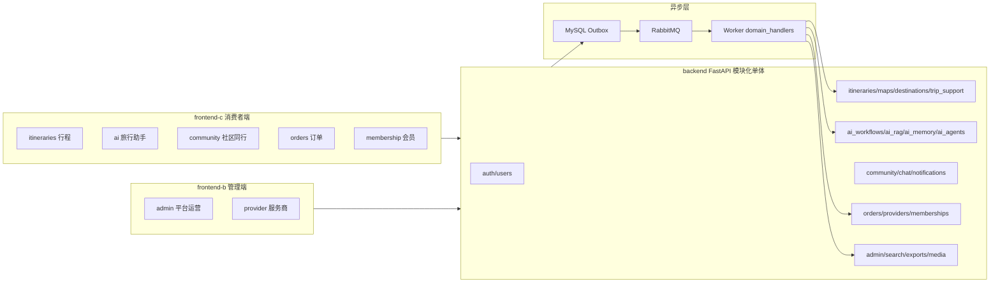

# 项目分包结构与业务职责详解

> 本文按“仓库 -> 应用 -> 业务包 -> 主要文件”的顺序讲解当前项目如何分包，以及每个包承担什么业务。重点是帮助你看到一个目录时，能立刻判断该去哪个文件找功能。
>
> 代码分包以当前仓库为准。部分功能仍在迭代，本文会区分“包负责什么”和“当前已经实现到什么程度”。

---

## 1. 先看全局：这是一个多应用仓库，不是一个大前端或一个大后端

根目录可以理解成四部分：

```text
the_third_project-v1/
├── backend/       FastAPI 后端与后台 Worker
├── frontend-c/    消费者端 Vue 应用，给普通旅行用户使用
├── frontend-b/    管理端 Vue 应用，给平台管理员和服务商使用
├── docs/          产品、接口、架构、部署和项目讲解文档
├── docker-compose.yml   本地 MySQL、Redis、RabbitMQ、Elasticsearch、Nginx
└── nginx/         API 与高德 JS 服务代理配置
```

三个应用是独立启动的：

| 目录 | 是什么 | 用户是谁 | 运行方式 |
| --- | --- | --- | --- |
| `backend/` | FastAPI 模块化单体 + Worker | 两个前端和外部回调 | `uvicorn app.main:app`；Worker 单独启动 |
| `frontend-c/` | 消费者端 Vue 3/Vite | 旅行用户 | 独立 `npm run dev` |
| `frontend-b/` | 管理端 Vue 3/Vite | 平台管理员、服务商员工 | 独立 `npm run dev -- --port 5174` |

这里的“模块化单体”含义是：后端虽然只有一个 FastAPI 进程和一个代码仓库，但按业务领域拆成多个 `app/modules/<领域>` 包；它不是把认证、行程、订单、AI 全都写在同一个文件里，也不是已经拆成许多微服务。

---

## 2. 后端总入口：请求怎样进入各个业务包

### 2.1 应用启动入口

**代码位置**：[backend/app/main.py](<D:\飞思\周正\the_third_project-v1\backend\app\main.py:1>)

`main.py` 不写具体业务，它只负责：

1. 创建 FastAPI 应用。
2. 配置 CORS，允许前端携带认证、幂等键、版本号等请求头。
3. 加入 `RequestIDMiddleware`，为每次请求读取或生成 `X-Request-ID`，方便跨 API、Worker、日志排查同一次请求。
4. 注册总路由。
5. 统一处理认证错误、参数校验错误和 HTTP 错误，返回统一错误结构。

### 2.2 API 总路由表

**代码位置**：[backend/app/api/router.py](<D:\飞思\周正\the_third_project-v1\backend\app\api\router.py:1>)

这个文件是所有业务路由的“总装配点”。它给全部 API 加 `/api/v1` 前缀，然后 `include_router(...)` 把认证、AI、行程、订单、社区等领域包接进来。

可以把一次请求理解为：

```text
前端请求 /api/v1/itineraries/...
  -> app/main.py 创建的 FastAPI
  -> app/api/router.py 总路由
  -> app/modules/itineraries/router.py
  -> app/modules/itineraries/service.py
  -> MySQL / Outbox / 外部地图服务
```

### 2.3 每个后端领域包的统一内部结构

多数业务包遵循下面的分层：

```text
app/modules/<domain>/
├── router.py     HTTP 接口：路径、登录身份、参数依赖、HTTP 状态码
├── service.py    业务规则：权限、状态机、事务、领域操作
├── schemas.py    Pydantic 请求/响应结构、字段校验
├── models.py     SQLAlchemy 表模型，仅属于这个领域的业务表
└── __init__.py   包导出或空标识
```

不是每个领域都完全一样：例如 AI RAG 多了适配器与检索算法；AI memory 多了 PostgreSQL 私有存储、投影 Worker；认证多了依赖注入和令牌逻辑。但判断文件职责时，先按上述四层理解基本不会错。

| 文件名 | 主要写什么 | 不应该写什么 |
| --- | --- | --- |
| `router.py` | API 路径、身份依赖、调用 service、转换业务异常 | 大段 SQL、复杂状态机、第三方协议细节 |
| `service.py` | 领域规则、权限、事务、业务状态变更、Outbox 事件 | Vue 页面、HTTP 路由定义 |
| `schemas.py` | 请求/响应字段、Pydantic 校验、枚举 | 真正的数据库读写 |
| `models.py` | 领域私有的 MySQL ORM 表、索引、约束 | API 返回文案或前端展示逻辑 |
| `contracts.py` | 跨组件传递的严格输入/输出类型 | 直接访问数据库 |

---

## 3. 后端基础包：不属于任何单一业务

### 3.1 `app/core`：所有后端包共享的基础能力

**目录**：[backend/app/core](<D:\飞思\周正\the_third_project-v1\backend\app\core>)

| 文件 | 业务/技术职责 |
| --- | --- |
| `settings.py` | 读取 `.env`，集中保存数据库、RabbitMQ、AI、地图、MCP、对象存储等配置。业务包不应散落读取环境变量。 |
| `database.py` | MySQL SQLAlchemy 引擎、`SessionLocal` 和请求级数据库会话依赖。 |
| `errors.py` | 将后端错误包装成统一响应格式。 |
| `request_context.py` | 在当前异步请求上下文存取 `request_id`，便于日志和错误响应关联。 |

### 3.2 `app/models`：跨领域共享业务模型

**目录**：[backend/app/models](<D:\飞思\周正\the_third_project-v1\backend\app\models>)

这里不放某个领域独有的表，而放多个模块都要用的基础模型：

| 文件 | 内容 |
| --- | --- |
| `base.py` | SQLAlchemy 基类、UUID 主键、时间戳、`utc_now()` 等通用能力。 |
| `user.py` | 用户、用户角色、登录会话、用户设置等全局身份相关表。 |
| `outbox.py` | Outbox 事件表。领域服务在同一 MySQL 事务中写业务事实与事件，Worker 再可靠发布。 |

### 3.3 `app/events`：可靠异步事件通道

**目录**：[backend/app/events](<D:\飞思\周正\the_third_project-v1\backend\app\events>)

| 文件 | 负责什么 |
| --- | --- |
| `publisher.py` | 扫描 MySQL Outbox 中待发送事件，发布到 RabbitMQ。 |
| `consumer.py` | RabbitMQ 消费器、事件路由注册表、去重/消费事务边界。 |

这层的核心价值是防止“业务已提交但异步任务丢失”。例如行程生成任务、路线计算、知识索引、导出任务都不是 API 直接硬调用 Worker，而是先写 Outbox。

### 3.4 `app/integrations`：第三方系统适配器

**目录**：[backend/app/integrations](<D:\飞思\周正\the_third_project-v1\backend\app\integrations>)

这个目录的规则是：**只封装外部协议，不承载平台自身的核心业务决策。**

| 子包 | 文件与职责 |
| --- | --- |
| `alipay/adapter.py` | 支付宝 WAP 沙箱的请求、验签、交易查询、退款等协议适配。订单状态机仍在 `orders` 包。 |
| `mcp/websearch.py` | WebSearch/Fetch MCP 的 Streamable HTTP 调用、HTTPS 候选校验、重排、正文切片。 |
| `mcp/transport.py` | 火车/航班 MCP 的交通报价工具适配。 |
| `object_storage/s3.py` | S3/MinIO 私有对象上传、下载签名 URL 等存储协议。 |
| `suppliers/client.py` | 受权供应商履约接口协议；默认不可用，避免伪造真实出票。 |
| `suppliers/mock_transport.py` | 当前模拟交通票据签发器，用于未接真实供应商时的受控演示。 |

---

## 4. 后端业务领域包：每个包具体做什么

### 4.1 账号、用户与权限

| 包 | 主要业务 | 核心文件 |
| --- | --- | --- |
| `auth/` | 短信验证码登录、访问令牌、刷新令牌、注销、消费者/管理端/服务商身份区分、实时通信票据。 | `router.py` 是登录接口；`service.py` 处理验证码和 token；`dependencies.py` 提供 `CurrentConsumer`、`CurrentAdmin` 等身份依赖；`realtime_tickets.py` 处理实时通道票据。 |
| `users/` | 用户资料、头像关联、旅行偏好设置、通知偏好、隐私设置、AI 权益查询。 | `router.py` 暴露 `/users/me`、`/users/me/settings`；`schemas.py` 定义设置字段。当前还包含 `settings:sync-ai-memory`，把已保存设置主动同步为 AI 旅行档案。 |
| `ai_entitlements/` | AI 次数权益。 | `service.py` 在生成行程或发送助手消息前消耗、释放、查询免费/会员权益。 |

**业务边界**：`auth` 负责“你是谁、有没有角色”；`users` 负责“你的资料和个人设置是什么”；`ai_entitlements` 负责“你还剩多少 AI 使用次数”。

### 4.2 行程、地点、地图和行程支持

| 包 | 主要业务 | 主要文件和说明 |
| --- | --- | --- |
| `itineraries/` | 行程本体：创建、读取、地点增删改排、版本快照、协作、分享、AI preview 应用、路线计算任务。 | `models.py` 包含行程、版本、协作、路线任务等表；`service.py` 是版本化修改和 `apply_operation` 核心；`router.py` 是行程 REST API。 |
| `destinations/` | 目的地联想搜索。 | `router.py` 提供 `/destinations`；`service.py` 调用地图能力返回标准目的地。 |
| `maps/` | 高德地图服务包装。 | `service.py` 搜索 POI、验证 POI、计算路线、开发环境代理高德 JS 服务；`router.py` 暴露 POI 搜索与前端地图配置。 |
| `trip_support/` | 行程执行期辅助内容。 | `models.py`、`service.py`、`router.py` 管理清单、预算记录、导游支持等贴近行程使用过程的能力。 |

一个典型链路是：

```text
前端选择目的地
  -> destinations 搜索标准城市/区域
  -> maps 搜索具体 POI
  -> itineraries 写入事件与新版本
  -> Outbox 发 itinerary.route_calculation_requested
  -> Worker 调 maps 计算路线
```

### 4.3 AI 行程生成、RAG、记忆与受控角色

这组包共同完成 AI 能力，但各自边界不同，不能把它们都叫成“AI 包”。

| 包 | 主要业务 | 核心文件 |
| --- | --- | --- |
| `ai_workflows/` | AI 行程生成任务、LangGraph 工作流、preview、用户确认前的校验和异步状态。 | `workflow.py` 是 8 个图节点和 `WorkflowState`；`runtime.py` 装配 RAG/LLM/地图/MCP/checkpoint；`dashscope.py` 调大模型生成 JSON 草案；`live_sources.py` 做实时地点候选；`service.py` 管理 generation job 与 Outbox；`router.py` 创建、查询、重试、查看、应用 preview。 |
| `ai_agents/` | 受控角色的结构化契约和确定性审查服务。 | `contracts.py` 定义检索、地图、规划、审查的数据结构；`services.py` 有受控检索、记忆过滤、地图路线、生成审查。它不是 DeepAgents 多智能体系统。 |
| `ai_rag/` | 公共/私有 RAG 的索引与检索算法。 | `ingestion.py` 切块、Embedding、Milvus/ES 双写；`retrieval.py` dense + BM25 + RRF；`catalog.py` 区分 OFFICIAL、COMMUNITY、USER_MEMORY；`adapters.py` 连接 Embedding、Milvus、Elasticsearch。 |
| `ai_memory/` | AI 私有 PostgreSQL：对话、消息、assistant run、显式长期记忆、preview、审计、checkpoint 支撑。 | `postgres.py` 是 AI 私有表与查询；`assistant.py` 是对话模型调用；`router.py` 是对话 SSE 和记忆 API；`private_retrieval.py` 做私有记忆 owner/version 二次闸门；`projection_worker.py` 把显式记忆投影至 USER_MEMORY。 |
| `ai_safety/` | 严格 AI 输入输出契约和校验。 | `contracts.py` 定义严格 Pydantic 模型；`validation.py` 做结构化安全校验。 |

这几个包的调用关系：

```text
ai_workflows
  -> ai_agents（受控检索、地图、审查）
  -> ai_rag（检索资料）
  -> ai_memory（读取私有记忆、保存 preview/audit/checkpoint）
  -> maps / integrations.mcp / DashScope

ai_memory 对话助手
  -> ai_rag（旅行事实问题）
  -> integrations.mcp.websearch（仅实时旅行问题的兜底）
  -> assistant.py（DashScope 普通或来源约束回答）
```

### 4.4 社区、同行计划、聊天和通知

| 包 | 主要业务 | 主要文件和说明 |
| --- | --- | --- |
| `community/` | 田野笔记帖子、评论、点赞、收藏、内容审核关联；同行计划发布、申请、成员关系、状态流转。 | `models.py` 放帖子/同行计划相关表；`service.py` 处理发布、申请、容量、审核、成员操作；`router.py` 按社区、同行、申请、审核拆成多个 router。 |
| `chat/` | 用户间/同行计划群聊。 | `models.py` 是会话与消息表；`service.py` 校验成员资格、拉取历史、发消息、屏蔽；`websocket.py` 维护实时连接与广播；`router.py` 提供 HTTP 消息接口。 |
| `notifications/` | 平台通知中心。 | `models.py` 存通知；`service.py` 做用户范围查询/已读；`router.py` 提供前端通知 API。实际通知由 Worker 根据领域事件和用户设置决定是否写入。 |

注意 `chat` 和 `ai_memory` 都有“会话/消息”，但不是同一个业务：

- `chat` 是用户与用户、同行成员之间的实时聊天。
- `ai_memory` 是用户与旅行助手的私有 AI 对话以及 AI 长短期记忆。

### 4.5 会员、服务商、体验、订单和支付

| 包 | 主要业务 | 主要文件和说明 |
| --- | --- | --- |
| `memberships/` | 会员计划定义与权益查询。 | `models.py` 放会员计划/权益相关表；`service.py` 管理计划和用户权益；`router.py` 给消费者和管理员接口。 |
| `membership_purchases/` | 购买会员的订单化过程。 | 负责购买请求、支付状态、权益激活的购买领域数据；不要和 `memberships` 的“计划定义”混淆。 |
| `providers/` | 服务商与体验产品。 | `models.py` 定义服务商、体验、场次、预约；`service.py` 校验服务商范围、POI、容量和核销；`router.py` 给服务商后台与消费者体验接口。 |
| `orders/` | 交通 Offer、旅行订单、支付、退款、履约和模拟票据。 | `models.py` 是报价快照、订单、支付、退款、模拟票据；`services.py` 是订单状态机、支付查询、退款、履约；`router.py` 对外提供查询/下单/支付等接口。 |

业务关系：

```text
memberships：卖什么会员计划、有什么权益
membership_purchases：用户怎么买会员、购买状态如何变化
ai_entitlements：会员或免费额度最终如何限制 AI 次数

providers：谁提供体验、体验和场次是什么
orders：用户购买的交通/旅行订单、支付和退款状态
```

### 4.6 媒体、导出、搜索和管理运营

| 包 | 主要业务 | 主要文件和说明 |
| --- | --- | --- |
| `media/` | 私有图片/文件资产的上传请求、上传完成确认、签名下载 URL、过期清理。 | `service.py` 对接对象存储并校验资产归属；`router.py` 是上传/完成/下载接口；`cli.py` 可执行清理。 |
| `exports/` | DOCX 导出任务。 | `renderer.py` 生成 DOCX；`service.py` 管理异步导出任务、到期清理；`router.py` 提交任务、查询状态、下载；Worker 负责实际渲染。 |
| `search/` | 平台业务搜索投影。 | `models.py` 存搜索投影状态；`service.py` 提供搜索与投影操作；`router.py` 提供搜索接口。它不同于 `ai_rag` 的 Milvus/ES 知识检索。 |
| `admin/` | 平台管理员运营工作台。 | `router.py` 聚合用户、内容、订单、知识、AI 任务、WebSearch 候选、搜索索引等管理 API；`knowledge_governance.py` 管理知识审核/版本/复审；`search_indexes.py` 和 `users.py` 是管理辅助逻辑；`models.py` 存官方知识、POI 候选、运营任务。 |

`search` 与 `ai_rag` 的区别很重要：

- `search` 是用户/运营可见的业务内容搜索及其投影状态。
- `ai_rag` 是给模型提供证据的知识检索，带审核、城市、可见性、知识域和用户隔离约束。

---

## 5. Worker 如何按业务包执行异步任务

### 5.1 Worker 启动与循环

**代码位置**：[backend/app/workers/main.py](<D:\飞思\周正\the_third_project-v1\backend\app\workers\main.py:1>)

Worker 和 API 是两个进程。Worker 循环做四件事：

1. 注册领域事件处理函数。
2. 从 RabbitMQ 消费事件。
3. 从 MySQL Outbox 发布未发送事件。
4. AI 开启时持续处理私有记忆投影任务，并向 Redis 写 heartbeat。

### 5.2 领域事件处理器

**代码位置**：[backend/app/workers/domain_handlers.py](<D:\飞思\周正\the_third_project-v1\backend\app\workers\domain_handlers.py:1>)

这个文件目前较大，因为它是“跨领域异步入口汇总处”。它不拥有业务规则，而是把事件分派给领域 service/runtime：

| 事件类别 | Worker 做什么 | 最终属于哪个业务包 |
| --- | --- | --- |
| `ai.generation_requested` | 打开 AI runtime，创建 LangGraph 工作流，更新 generation job 状态 | `ai_workflows` |
| 知识索引事件 | 审核社区/官方资料后写入 RAG 双索引 | `admin` + `community` + `ai_rag` |
| `itinerary.route_calculation_requested` | 调高德计算路线并更新路线任务 | `itineraries` + `maps` |
| 导出事件 | 调 DOCX renderer，上传导出文件，更新任务状态 | `exports` + `media` |
| 订单/支付/履约/退款事件 | 查询支付、模拟票据、供应商履约、退款处理 | `orders` + `integrations` |
| 社区/同行事件 | 写入符合用户通知开关的站内通知 | `community` + `notifications` |
| 清理事件 | 删除过期上传、过期导出 | `media` + `exports` |

因此，`domain_handlers.py` 很长不代表所有逻辑都写在那里；它更多是异步编排/调度层。真正的数据模型和业务约束仍在各自的 `modules/<domain>` 中。

---

## 6. 消费者端 `frontend-c` 如何分包

### 6.1 消费者端路由是功能包地图

**代码位置**：[frontend-c/src/router/index.ts](<D:\飞思\周正\the_third_project-v1\frontend-c\src\router\index.ts:1>)

消费者端以 `src/features/<功能>` 组织，而不是按 `components`、`pages`、`api` 混在全局目录。每个功能包尽量把页面、接口封装、局部 store、局部组件和测试放在一起。

| 功能包 | 面向用户的业务 | 关键文件 |
| --- | --- | --- |
| `home/` | 首页与旅行入口。 | `HomePage.vue` |
| `auth/` | 登录、无权限页面。 | `LoginPage.vue`、`NoAccessPage.vue` |
| `itineraries/` | 智能/手动规划、行程列表、行程工作台、分享、地图、时间线、AI preview、导出、行程支持。 | `pages/PlanPage.vue`、`pages/ItineraryWorkspacePage.vue`、`stores/itinerary.ts`、`stores/aiPlanning.ts`、`api.ts`、`aiPlanningApi.ts`、`components/MapPanel.vue`、`Timeline.vue`、`TripSupportPanel.vue` |
| `ai/` | 旅行助手、助手对话、显式 AI 记忆、已有行程自然语言修改入口。 | `pages/AiAssistantPage.vue`、`assistantApi.ts` |
| `settings/` | 账户旅行偏好、通知和隐私设置；主动同步旅行档案为 AI 记忆。 | `SettingsPage.vue`、`api.ts` |
| `profile/` | 个人资料、昵称、头像。 | `ProfilePage.vue`、`api.ts` |
| `community/` | 田野笔记、发布、详情、我的内容、同行计划、申请和活动。 | `FieldNotesPage.vue`、`FieldNotePublishPage.vue`、`CompanionPlansPage.vue`、`companionPlansApi.ts`、`components/` |
| `chat/` | 同行/用户聊天页面、聊天历史、消息编辑器、WebSocket 客户端。 | `ChatPage.vue`、`ChatHistory.vue`、`ChatComposer.vue`、`api.ts` |
| `experiences/` | 浏览体验产品与详情。 | `ExperiencesPage.vue`、`ExperienceDetailPage.vue`、`api.ts` |
| `orders/` | 火车/航班搜索、订单列表、支付返回、退款、票据状态。 | `pages/SearchPage.vue`、`OrdersPage.vue`、`AlipayReturnPage.vue`、`components/`、`api.ts` |
| `membership/` | 会员计划、二维码支付、支付返回、我的 AI 权益。 | `MembershipPlansPage.vue`、`MembershipQrPaymentPage.vue`、`MyEntitlementsPage.vue`、`api.ts` |
| `notifications/` | 站内通知查看与已读。 | `NotificationsPage.vue`、`api.ts` |
| `media/` | 头像、社区图片等私有上传和签名访问。 | `api.ts`、`components/ImageReferenceUpload.vue` |

### 6.2 消费者端包内常见文件怎么读

```text
src/features/itineraries/
├── pages/         路由级页面：规划页、行程工作台等
├── components/    本业务可复用组件：地图、时间线、行程支持面板
├── stores/        Pinia 状态：行程编辑状态、AI 任务轮询、导出任务状态
├── api.ts         本领域 API 调用与 TypeScript 类型
├── xxxApi.ts      领域内更细的 API，例如 aiPlanningApi、exportApi
└── *.test.ts      与同目录业务代码匹配的 Vitest 测试
```

例如要找“用户点击生成修改预览后发生了什么”：先看 `features/ai/pages/AiAssistantPage.vue` 的 `modifyItinerary`，它会调用 `features/itineraries/stores/aiPlanning.ts`，再走 `aiPlanningApi.ts` 请求后端 generation job。

---

## 7. 管理端 `frontend-b` 如何分包

### 7.1 管理端不只是管理员，也包含服务商工作台

**代码位置**：[frontend-b/src/router/index.ts](<D:\飞思\周正\the_third_project-v1\frontend-b\src\router\index.ts:1>)

管理端按身份分两类页面：

- `platform_admin`：平台运营、内容审核、AI 知识、搜索索引、用户、会员、导出任务。
- `provider_admin` / `provider_staff`：服务商体验管理、预约列表、现场核销。

| 功能包 | 业务 | 关键文件 |
| --- | --- | --- |
| `auth/` | 管理端/服务商登录与无权限处理。 | `LoginPage.vue`、`NoAccessPage.vue` |
| `admin/` | 平台运营。 | `pages/OperationsPage.vue` 复用一个页面处理帖子、同行计划、举报、服务商、订单；`AiOperationsPage.vue` 管理 AI 知识/任务/网页候选；`PoiCandidatesPage.vue` 管理候选 POI；`UsersPage.vue` 管理用户；`SearchIndexesPage.vue` 管理搜索索引；`services/` 是对应 API 封装。 |
| `provider/` | 服务商工作台。 | `pages/ProviderExperiencesPage.vue` 管理体验和场次；`ProviderBookingsPage.vue` 看预约、进行核销；`services/experiences.ts` 封装接口。 |
| `membership/` | 管理会员计划和购买记录。 | `pages/MembershipPlansPage.vue`、`MembershipPurchasesPage.vue`、`services/` |
| `exports/` | 管理查看导出任务。 | `pages/ExportTasksPage.vue`、`services/exportTasks.ts` |

### 7.2 为什么管理端 `OperationsPage.vue` 看起来管很多事情

`OperationsPage.vue` 通过路由传入的 `area` 参数复用同一套表格、详情抽屉和审核操作：

```text
/content/posts       -> area=content
/content/companions  -> area=companions
/content/reports     -> area=reports
/providers           -> area=providers
/orders              -> area=orders
```

复用的是“运营列表页面的外壳”，不是把后端领域混为一谈；实际请求仍分别在 `services/operations.ts` 中调用对应后端 API。

---

## 8. 一张总图：从页面包到后端领域包



---

## 9. 找代码的实用索引

| 你想找的业务 | 优先看哪里 |
| --- | --- |
| 用户为什么登录失败/没有权限 | `backend/app/modules/auth/`，前端对应 `frontend-c/src/features/auth/` 或 `frontend-b/src/features/auth/` |
| 用户设置保存后在哪里 | `backend/app/modules/users/router.py`，前端 `frontend-c/src/features/settings/` |
| AI 行程怎么生成 | `backend/app/modules/ai_workflows/workflow.py`、`runtime.py`、`dashscope.py` |
| AI 对话助手怎么回答 | `backend/app/modules/ai_memory/router.py`、`assistant.py`，前端 `frontend-c/src/features/ai/` |
| RAG 为什么搜到这些资料 | `backend/app/modules/ai_rag/retrieval.py`、`catalog.py`、`adapters.py` |
| 用户记忆如何进私有 RAG | `backend/app/modules/ai_memory/postgres.py`、`projection_worker.py`、`private_retrieval.py` |
| 行程编辑为什么会生成新版本 | `backend/app/modules/itineraries/service.py` |
| 为什么路线不是立即生成 | `backend/app/workers/domain_handlers.py` 中的路线事件处理，及 `itineraries`/`maps` 包 |
| 社区/同行计划在哪里 | 后端 `modules/community/`，前端 `frontend-c/src/features/community/` |
| 用户聊天为什么走 WebSocket | 后端 `modules/chat/websocket.py`，前端 `frontend-c/src/features/chat/` |
| 管理员审核 AI 知识在哪里 | 后端 `modules/admin/`，前端 `frontend-b/src/features/admin/pages/AiOperationsPage.vue` |
| 订单、支付、退款在哪里 | `backend/app/modules/orders/`，外部协议在 `backend/app/integrations/alipay/`、`mcp/transport.py` |
| 异步任务为什么没跑 | `backend/app/events/`、`backend/app/workers/main.py`、`backend/app/workers/domain_handlers.py` |

---

## 10. 最后总结：这个项目的分包原则

项目并不是按“技术名词”随意分文件夹，而是按下面四条原则分包：

1. **按业务领域分包**：行程、社区、订单、会员、服务商、AI、用户分别有独立目录、模型和服务。
2. **HTTP 与业务规则分层**：`router.py` 管接口，`service.py` 管规则，`schemas.py` 管输入输出，`models.py` 管本领域数据表。
3. **跨领域技术能力单独放**：RAG、AI memory、MCP、对象存储、支付协议、事件系统、Worker 不塞进任意一个业务领域。
4. **前端按用户功能分包**：消费者端和管理端各自按页面业务组织，接口、组件、状态和测试尽量就近放置。

因此，读代码时优先问“这是哪个业务的事实和规则”，再进入对应领域包；只有当问题涉及异步、外部服务、AI 检索或跨领域通知时，才去看 `events`、`workers`、`integrations` 或 AI 技术包。
